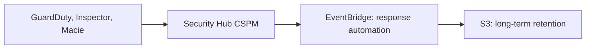

AWS detection is split across services: CloudTrail records API activity, GuardDuty detects threats, and Security Hub aggregates findings. This page describes the pipeline that connects them, then each service in turn.

## The findings pipeline

AWS's detective services each produce findings, but none keeps them long. The notes describe the same pipeline: detect, aggregate, route, and export.

### Retention is short everywhere

| Service | Built-in retention |
| --- | --- |
| GuardDuty findings | 90 days, fixed |
| Security Hub CSPM findings | 90 days |
| CloudTrail event history | 90 days, cannot be extended |

So every note recommends exporting: GuardDuty findings to S3, Security Hub findings archived through EventBridge, and CloudTrail events to a trail or Lake event data store.[^aws-guardduty][^aws-security-hub][^aws-cloudtrail]

### Wiring rules

- A service's findings reach Security Hub only if that service and its integration are enabled in the same Region.[^aws-security-hub]
- Filters and suppression rules hide findings; they do not fix causes.[^aws-guardduty]

Across many accounts, these services run from a delegated administrator account; see [AWS multi-account governance](multi-account-governance.md).

## AWS CloudTrail

CloudTrail records actions taken by users, roles, and AWS services as events, for auditing, governance, and compliance. It has three layers of increasing commitment.

| Layer | What it keeps |
| --- | --- |
| Event history | The past 90 days of management events per Region; free, on by default, cannot be extended |
| Trail | Management events and selected data and Insights events delivered to S3, optionally to CloudWatch Logs and EventBridge |
| CloudTrail Lake | An event data store queried with SQL, kept up to 2,557 days (about 7 years) or 3,653 days (about 10 years) depending on pricing |

As described in the note.

**Management events** are control-plane operations; **data events** are resource operations such as S3 object access or Lambda invocations, which is why they are recorded selectively to control cost. Insights events flag unusual API rates and errors.[^aws-cloudtrail]

### Practices

- An organization trail from the management account to a dedicated, encrypted, private, versioned S3 bucket; member accounts cannot disable it.
- Alarm on trail status so logging does not stop silently, and restrict `StopLogging` and `DeleteTrail` with IAM and SCPs.[^aws-cloudtrail]

### Troubleshooting

| Symptom | Check |
| --- | --- |
| No events delivered | Trail logging, bucket policy, KMS key permissions |
| Data events missing | Event selectors |
| Only 90 days available | Event history is fixed; create a trail or Lake store |

As tabled in the note.[^aws-cloudtrail]

## Amazon GuardDuty

GuardDuty continuously analyzes CloudTrail management events, VPC Flow Logs, and DNS logs, using threat intelligence and machine learning to produce security findings. Optional protection plans add EKS audit logs, RDS logins, S3 data events, malware scanning, runtime monitoring, Lambda network activity, and AI workloads.[^aws-guardduty]

### Concepts

- One **detector** per account per Region; findings have Low, Medium, or High severity.
- Foundational sources start ingesting as soon as it is enabled; protection plans are enabled separately.
- Filters and suppression rules reduce noise but hide findings rather than fix causes.[^aws-guardduty]

### Practices

- Enable in all Regions and accounts, managed through Organizations with a delegated administrator.
- Send findings to EventBridge and Security Hub CSPM, and export to S3 to keep them beyond 90 days.
- Test the pipeline with sample findings.[^aws-guardduty]

### Troubleshooting and limits

| Symptom | Check |
| --- | --- |
| No findings | Detector enabled, sources ingesting; generate samples |
| Missing S3, EKS, or RDS detection | The matching protection plan in the same Region |
| Accidental deletion | `delete-detector` removes findings; suspend with `update-detector --no-enable` instead |

As tabled in the note. Findings are kept 90 days (fixed); up to 6 threat intelligence sets and 100 filters per detector.[^aws-guardduty] See [Security findings pipeline](#the-findings-pipeline).

## AWS Security Hub CSPM

Security Hub Cloud Security Posture Management (CSPM) gives a consolidated view of an environment's security state: it collects findings from services such as GuardDuty, Inspector, and Macie and from partners, and runs continuous checks against standards.[^aws-security-hub]

### Concepts

- Findings are normalized into the AWS Security Finding Format (ASFF).
- Standards include AWS Foundational Security Best Practices (FSBP), CIS, PCI DSS, and NIST; each contains controls that run configuration checks, and most controls need AWS Config recording in the account and Region.
- Security scores, insights, automation rules, and cross-Region aggregation.[^aws-security-hub]

### Practices

- Enable in all supported Regions with cross-Region aggregation, and enable AWS Config for the resource types standards check.
- Use a delegated administrator; route findings to EventBridge for remediation; disable unused standards to control cost.[^aws-security-hub]

### Troubleshooting and limits

| Symptom | Check |
| --- | --- |
| No findings after enabling | AWS Config recording, standards enabled, Region supported |
| GuardDuty or Inspector findings absent | The service and its integration in the same Region |
| Unexpected costs | Disable unused standards and controls |

As tabled in the note. Findings are kept 90 days; archive to S3 through EventBridge for longer.[^aws-security-hub] See [Security findings pipeline](#the-findings-pipeline).

## Related
- [Compliance and posture](compliance-and-posture.md): configuration recording and vulnerability scanning.
- [Application security](application-security.md): WAF, Shield, certificates, and user sign-in.
- [Domain index](index.md): other pages in this domain.

[^aws-guardduty]: [Amazon GuardDuty - Runbook & Reference](../../sources/aws-guardduty.md), [original](https://github.com/kelvinlee97/engineering/blob/main/AWS/guardduty/README.md)
[^aws-security-hub]: [AWS Security Hub CSPM - Runbook & Reference](../../sources/aws-security-hub.md), [original](https://github.com/kelvinlee97/engineering/blob/main/AWS/security-hub/README.md)
[^aws-cloudtrail]: [AWS CloudTrail - Runbook & Reference](../../sources/aws-cloudtrail.md), [original](https://github.com/kelvinlee97/engineering/blob/main/AWS/cloudtrail/README.md)
