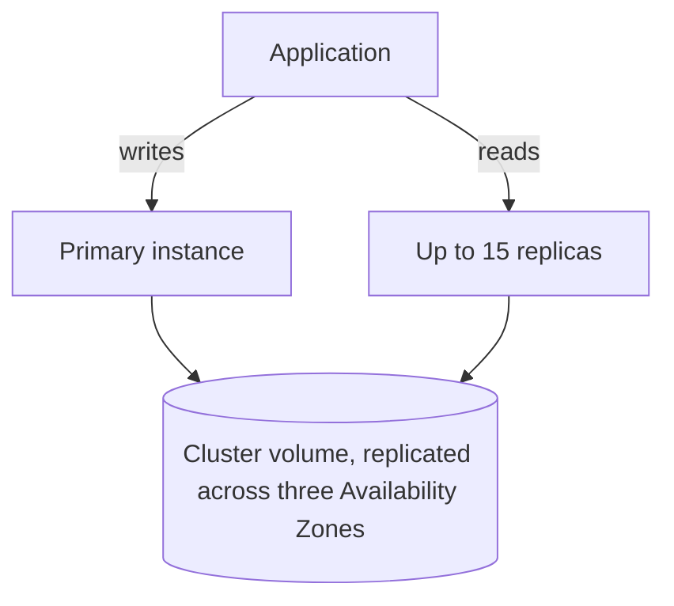

Beyond relational tables and key-value items (see [Data stores](data-stores.md)), AWS offers databases shaped around one data model: DocumentDB for JSON documents with MongoDB compatibility, Neptune for graphs, and Managed Blockchain for shared ledgers across organizations. QLDB, the former ledger database, reached end of support in 2025 and appears here only to guide migration off it.

## Choosing a database

| Your data is | Use | Query with | Status |
| --- | --- | --- | --- |
| JSON documents, and your code uses MongoDB drivers | [DocumentDB](#amazon-documentdb) | MongoDB APIs and tools | Available |
| Highly connected: fraud rings, recommendations, knowledge graphs | [Neptune](#amazon-neptune) | Gremlin or openCypher (property graphs), SPARQL (RDF) | Available |
| A ledger shared by several organizations, or access to public chains | [Managed Blockchain](#amazon-managed-blockchain) | Hyperledger Fabric chaincode, or Ethereum and Bitcoin APIs | Available |
| An append-only, verifiable history inside one organization | Aurora PostgreSQL with an append-only audit design | SQL | The documented replacement for [QLDB](#amazon-qldb), which ended July 31, 2025 |

## One primary, shared storage: DocumentDB and Neptune

DocumentDB and Neptune share an architecture: storage is separate from compute. One primary instance takes all writes, up to 15 replicas serve reads, and all of them use the same cluster volume, which is replicated across three Availability Zones and grows automatically. Reads scale by adding replicas; writes scale only by a larger primary.

Put replicas in different Availability Zones so failover has somewhere to go, and keep automated backups on: both databases back up continuously to S3 with point-in-time recovery (PITR), which needs a backup retention setting.[^aws-documentdb][^aws-neptune]

### Amazon DocumentDB

DocumentDB runs MongoDB application code, drivers, and tools unchanged. Its volume keeps six copies across the three zones and grows in 10 GB steps, up to 256 TiB on engine 8.0 and later (128 TiB before). Point-in-time recovery reaches the last 5 minutes, with retention up to 35 days. Elastic clusters, a separate deployment type, reach millions of reads and writes per second and petabyte-scale storage.

- Send reads to the reader endpoint, which balances them across replicas.
- Build indexes for your query patterns and check them with `explain`.[^aws-documentdb]

| Symptom | Check |
| --- | --- |
| Connection failures | Security groups, TLS, and that the client uses the cluster endpoint on port 27017 |
| Read latency | More replicas behind the reader endpoint; replica lag |
| Storage at the engine limit | Elastic clusters, or archiving data |

### Amazon Neptune

Neptune stores property graphs, queried with Apache TinkerPop Gremlin or openCypher, and RDF graphs, queried with SPARQL. Its SSD-backed volume is self-healing. Graphs pay off where data has high-fanout nodes and deep traversals that would take many relational joins. Neptune Analytics loads large graphs from Neptune or a data lake into memory for analysis.

- Design IDs and indexes for your queries and avoid full-graph scans; slow traversals often come from super-nodes, nodes with very many edges.
- Low write throughput calls for a larger primary instance class.[^aws-neptune]

## Amazon Managed Blockchain

Managed Blockchain (AMB) comes in two independent shapes. AMB Access gives API access to public Ethereum and Bitcoin nodes, fully managed, dedicated (single-tenant), or serverless multi-tenant, using accessors, which hold token-based access information. Private networks run Hyperledger Fabric for permissioned use: each member organization runs peer nodes that host the ledger and chaincode, and changes to chaincode or membership pass by proposal and vote.

- Run several peer nodes across Availability Zones.
- Guard membership: proposals and votes decide who joins and what changes. The framework version is fixed when the network is created.
- A failing proposal usually means the voting threshold or a member's permissions; denied token access means a missing accessor or invalid token.[^aws-managed-blockchain]

## Amazon QLDB

QLDB was a ledger database with an append-only journal, cryptographic verification of its history, and PartiQL queries. Support ended on July 31, 2025, and no new ledgers can be created. For an existing ledger: follow the official guide to migrate to Aurora PostgreSQL with an append-only audit design, export the journal to S3 as a retention record, then delete the ledger and its IAM roles and policies.[^aws-qldb]

## Related

- [Data stores](data-stores.md): RDS, DynamoDB, ElastiCache, and S3.
- [Storage and migration](storage-and-migration.md): Database Migration Service for moving into these databases.
- [Domain index](index.md)

[^aws-documentdb]: [Amazon DocumentDB - Runbook & Reference](../../sources/aws-documentdb.md), [original](https://github.com/kelvinlee97/engineering/blob/main/AWS/documentdb/README.md)
[^aws-neptune]: [Amazon Neptune - Runbook & Reference](../../sources/aws-neptune.md), [original](https://github.com/kelvinlee97/engineering/blob/main/AWS/neptune/README.md)
[^aws-managed-blockchain]: [Amazon Managed Blockchain (AMB) - Runbook & Reference](../../sources/aws-managed-blockchain.md), [original](https://github.com/kelvinlee97/engineering/blob/main/AWS/managed-blockchain/README.md)
[^aws-qldb]: [Amazon QLDB - Runbook & Reference](../../sources/aws-qldb.md), [original](https://github.com/kelvinlee97/engineering/blob/main/AWS/qldb/README.md)
