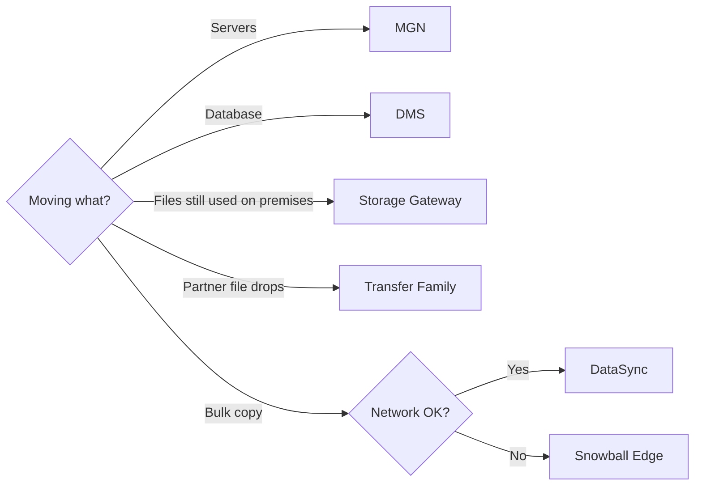

This page covers two jobs. The first is protecting and sharing data once it is in AWS: AWS Backup for policy-driven backups and FSx for managed file systems. The second is getting data and servers into AWS: Storage Gateway for ongoing hybrid access, DataSync and the Snow Family for bulk file transfer, Transfer Family for partners who send files over SFTP or FTP, and MGN and DMS for migrating whole servers and databases.

## Choosing a way in

The first question is what you are moving, then whether the network can carry it.

| Service | Moves | How | Ongoing or one-time |
| --- | --- | --- | --- |
| [Storage Gateway](#aws-storage-gateway) | Files, block volumes, tapes | An on-premises appliance with a local cache, backed by S3 or FSx | Ongoing hybrid access |
| [DataSync](#aws-datasync) | Files and objects (NFS, SMB, S3, EFS, FSx) | An agent and a purpose-built transfer protocol | One-time or scheduled |
| [Snow Family](#aws-snow-family) | Files and objects into S3 | A shipped device | One-time, offline |
| [Transfer Family](#aws-transfer-family) | Files into S3 or EFS | Managed SFTP, FTPS, FTP, AS2, and web endpoints | Ongoing |
| [MGN](#aws-application-migration-service) | Whole servers | Continuous block-level replication, then cutover | One-time, minutes of downtime |
| [DMS](#aws-database-migration-service) | Databases and warehouses | Full load plus change data capture | One-time or ongoing replication |

Analysis: the Snow Family note itself points new online transfers to DataSync; the flowchart's other branches follow each note's description of what it moves.

## AWS Backup

AWS Backup applies backup policies across supported AWS services from one place. It separates three decisions: a backup plan's rules set how often to back up and how long to keep each backup; the backup vault it lands in, a per-Region container with its own access policy, sets how protected it is; and copy rules set whether it is also copied to another Region or account. Lifecycle rules move backups from warm to cold storage after a set period; cold restores are slower and cold storage has minimum retention periods.

| Vault Lock mode | Effect |
| --- | --- |
| Governance | Write-once (WORM) protection; test in this mode before enforcing compliance mode |
| Compliance | Permanent: backups cannot be deleted even by administrators, and the lock cannot be removed |

- Group plans by workload class, such as database, application, or file, and assign resources by tag.
- Copy critical backups to another Region, and to another account to isolate them from production.
- A missing cross-account copy usually means the destination vault policy or the copy role.[^aws-backup]

## Amazon FSx

FSx is a family of managed file systems; choose by protocol and workload. Each file system sets storage capacity, throughput, and (on Windows) SSD IOPS independently, and takes automatic daily incremental backups.

| Type | Protocol | For |
| --- | --- | --- |
| FSx for Windows File Server | SMB, with Active Directory authentication | Windows file shares; Multi-AZ fails over across two zones |
| FSx for Lustre | Parallel file system, exported over NFS | High-performance computing |
| FSx for NetApp ONTAP, FSx for OpenZFS | NFS | NAS features |

- Use Multi-AZ Windows file systems in production, and Single-AZ where cost matters and downtime is acceptable.
- Mount failures usually mean security groups (SMB 445, NFS 2049) or a client VPC that is not peered or on a transit gateway; Windows sign-in failures mean the AD join, DNS, or the user's AD account.[^aws-fsx]

## AWS Storage Gateway

Storage Gateway is a VM or hardware appliance in your data center that gives on-premises systems AWS-backed storage. OpsHub deploys and monitors gateways.

| Gateway type | Presents | Where primary data lives |
| --- | --- | --- |
| S3 File Gateway | SMB or NFS shares, with a local cache | S3 (or FSx) |
| Volume Gateway, cached | iSCSI block volumes | S3, with hot data cached locally |
| Volume Gateway, stored | iSCSI block volumes | On premises, backed up as EBS snapshots |
| Virtual tape library | Tape drives and libraries over iSCSI | S3, archivable to Glacier |

- Size the local cache for the working set; a full cache calls for a bigger disk or a smaller working set.
- Throttle gateway bandwidth to protect the WAN link.[^aws-storage-gateway]

## AWS DataSync

DataSync copies file and object data to, from, and between AWS storage, on-premises storage (through an agent VM), and other clouds, with encryption and integrity checks. A task copies from a source location to a destination location on demand or on a schedule, with options to overwrite and preserve metadata.

- Test on a subset first, then run the full migration; alarm on transfer errors.
- Place the agent close to the data, and split very large datasets across several tasks or agents.
- Slow transfers usually come from agent sizing, bandwidth, or many small files; wrong permissions on copied files mean the task's POSIX or SMB metadata options.[^aws-datasync]

## AWS Snow Family

Snow Family devices move data offline, or run compute at the edge, where connectivity is poor. Snowcone was discontinued on November 12, 2024, and Snowball Edge is closed to new customers; new online transfers should use DataSync. For existing customers, Snowball Edge comes Storage Optimized (210 TB, up to 40 vCPUs) or Compute Optimized (up to 104 vCPUs, with GPU options), exposes S3- and EC2-compatible endpoints and NFS, and can cluster 3-16 devices.

- Set up the S3 bucket, IAM role, and shipping address before creating the job; a shipped job generally cannot be cancelled.
- Data appears in S3 only after AWS processes the returned device.[^aws-snow-family]

## AWS Transfer Family

Transfer Family runs managed SFTP, FTPS, FTP, and AS2 servers, plus browser-based web apps, in front of S3 or EFS. Partners keep their existing clients and firewall rules; AWS scales the servers, and you pay for use. Users authenticate as service-managed users, through AWS Directory Service, or through a custom identity provider backed by Lambda or API Gateway. Managed workflows process uploaded files: copy, tag, scan, filter, compress, and encrypt.

- Use a VPC endpoint for private transfer, and give each user an IAM role scoped to a home directory.
- FTP and FTPS data connections need ports 8192-8200 open.[^aws-transfer-family]

## AWS Application Migration Service

Application Migration Service (MGN, now documented as AWS Transform MGN) moves physical, virtual, and cloud servers to AWS. An agent on each source server replicates its disks at block level, continuously, to a staging area in your account, so the target stays warm and cutover takes minutes. Templates control replication, launch, and post-launch configuration; applications group servers, and waves group applications for bulk launch and cutover.

- Test-launch a representative sample and check boot, networking, and the application before cutting over.
- Order waves by dependency, so dependent servers do not cut over before what they depend on.
- Replication lag points at source bandwidth, disk I/O, or the agent.[^aws-mgn]

## AWS Database Migration Service

DMS migrates relational databases, warehouses, NoSQL databases, and other stores into AWS or between cloud and on-premises environments. A replication instance runs tasks between a source and a target endpoint; a task does a full load, ongoing replication by change data capture (CDC), or both. Fleet Advisor inventories on-premises database servers, and DMS Schema Conversion or the AWS Schema Conversion Tool converts schemas to another engine.

- Run Fleet Advisor and schema conversion early, then a full-load test with DMS data validation.
- Growing CDC lag points at source log retention (such as Oracle archive logs) or replication instance capacity.[^aws-dms]

## Related

- [Data stores](data-stores.md): S3, RDS, and DynamoDB, the usual destinations.
- [Specialized databases](specialized-databases.md): DocumentDB and Neptune as DMS targets.
- [Networking](networking.md): Direct Connect for large ongoing transfers.
- [Domain index](index.md)

[^aws-backup]: [AWS Backup - Runbook & Reference](../../sources/aws-backup.md), [original](https://github.com/kelvinlee97/engineering/blob/main/AWS/backup/README.md)
[^aws-fsx]: [Amazon FSx - Runbook & Reference](../../sources/aws-fsx.md), [original](https://github.com/kelvinlee97/engineering/blob/main/AWS/fsx/README.md)
[^aws-storage-gateway]: [AWS Storage Gateway - Runbook & Reference](../../sources/aws-storage-gateway.md), [original](https://github.com/kelvinlee97/engineering/blob/main/AWS/storage-gateway/README.md)
[^aws-datasync]: [AWS DataSync - Runbook & Reference](../../sources/aws-datasync.md), [original](https://github.com/kelvinlee97/engineering/blob/main/AWS/datasync/README.md)
[^aws-snow-family]: [AWS Snow Family - Runbook & Reference](../../sources/aws-snow-family.md), [original](https://github.com/kelvinlee97/engineering/blob/main/AWS/snow-family/README.md)
[^aws-transfer-family]: [AWS Transfer Family - Runbook & Reference](../../sources/aws-transfer-family.md), [original](https://github.com/kelvinlee97/engineering/blob/main/AWS/transfer-family/README.md)
[^aws-mgn]: [AWS Application Migration Service (MGN) - Runbook & Reference](../../sources/aws-mgn.md), [original](https://github.com/kelvinlee97/engineering/blob/main/AWS/mgn/README.md)
[^aws-dms]: [AWS Database Migration Service (DMS) - Runbook & Reference](../../sources/aws-dms.md), [original](https://github.com/kelvinlee97/engineering/blob/main/AWS/dms/README.md)
