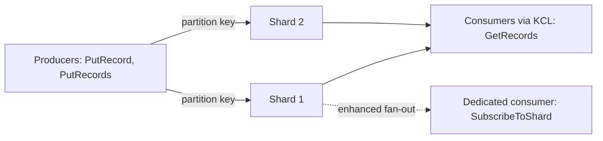

This page covers two families. Streaming services (Kinesis and MSK) keep an ordered, replayable log of records that many consumers can read at their own pace. Search services (OpenSearch and CloudSearch) index documents so they can be found by full-text queries. For queues and event buses where ordering and replay are not the point, see [Messaging](messaging.md).

## Choosing a service

| | Kinesis Data Streams | MSK | OpenSearch Service | CloudSearch |
| --- | --- | --- | --- | --- |
| Job | Stream records | Stream records | Search and log analytics | Search |
| API | AWS (`PutRecord`, `GetRecords`) | Standard Apache Kafka | OpenSearch, and Elasticsearch OSS up to 7.10 | HTTP search and document endpoints |
| Capacity unit | Shard, or on-demand | Broker, or Serverless | Data nodes, with UltraWarm and cold tiers | Search instances |
| Choose it when | You want an AWS-native stream with little to run | Your applications and tools already speak Kafka | You need current search features, logs, or dashboards | Only if you already use it; closed to new customers |

Analysis: within streaming, the Kinesis note itself says to use Data Firehose when you only need reliable delivery to storage or analytics, and Data Streams when you need custom consumers or replay.

## Amazon Kinesis

Kinesis is AWS's streaming platform: Kinesis Data Streams, Amazon Data Firehose, Managed Service for Apache Flink, and Kinesis Video Streams. In Data Streams, a record is a partition key plus a data blob; the key picks the shard, and records are ordered within a shard.

| Limit | Value |
| --- | --- |
| Write per shard | 1 MB/s or 1,000 records/s |
| Read per shard | 2 MB/s, or 2 MB/s per consumer with enhanced fan-out |
| Retention | 24 hours by default, up to 365 days |

- On-demand mode scales shards for you; provisioned mode uses a shard count you manage.
- Spread partition keys so no hot key overloads one shard, and watch `WriteProvisionedThroughputExceeded`.
- Consume with the Kinesis Client Library (KCL), which checkpoints progress and handles shard changes.[^aws-kinesis]

| Symptom | Check |
| --- | --- |
| `ProvisionedThroughputExceededException` | More shards, better key distribution, or on-demand mode |
| Records lost | Retention against consumer checkpoints; a slow consumer's checkpoints lag |
| High consumer lag | More shards or consumers, enhanced fan-out, or lighter processing |
| Firehose delivery failures | Destination permissions and buffering settings |

## Amazon MSK

Amazon Managed Streaming for Apache Kafka runs the Kafka control plane (creating, updating, and deleting clusters) while applications keep the standard Kafka data-plane APIs, so existing clients and tools such as kcat work unchanged. MSK Connect runs managed connectors into and out of clusters.

| Mode | You choose | AWS manages | Fits |
| --- | --- | --- | --- |
| Provisioned | Broker count and type (Standard or Express) | ZooKeeper nodes or KRaft controllers | Predictable capacity and control |
| Serverless | Cluster-level settings | Broker capacity and scaling | Variable traffic |

- Place brokers across at least three Availability Zones (the minimum is one broker per zone) and size them for peak throughput.
- Authenticate with IAM or SASL/SCRAM with secrets in Secrets Manager, over TLS.[^aws-msk]

| Symptom | Check |
| --- | --- |
| Clients cannot connect | Bootstrap brokers, security groups, and authentication settings |
| Under-replicated partitions or `NotEnoughReplicasException` | Broker health, disk, and replication factor |
| Disk full | Storage or retention; watch `KafkaDataLogsDiskUsed` |

## Amazon OpenSearch Service

OpenSearch Service runs OpenSearch clusters, called domains, for log analytics, application monitoring, clickstream analysis, and full-text search. It supports current OpenSearch releases, including 3.x, and legacy Elasticsearch OSS up to 7.10. A domain can hold up to 1,002 data nodes and 25 PB of attached storage, and places data on tiers by age and cost: hot data nodes for active queries, and UltraWarm and cold storage, backed by S3, for older read-only data. OpenSearch Dashboards is built in.

- In production, run three data nodes plus dedicated master nodes across Availability Zones.
- Turn on encryption at rest, node-to-node encryption, and HTTPS only.[^aws-opensearch]

| Symptom | Check |
| --- | --- |
| Cluster status `red` | Unassigned shards: disk space, node count, or replica settings |
| High JVM memory pressure | Larger instances, more nodes, or simpler indexes |
| Indexing rejected | Capacity and bulk request size |
| Dashboards unreachable | Cognito, basic, or SAML auth, and VPC security groups |

## Amazon CloudSearch

CloudSearch is a managed search service over web pages, documents, forum posts, and product data. It is closed to new customers; existing customers can keep using it. A domain has two endpoints: uploads go to the document endpoint, queries to the search endpoint. Uploaded data is not searchable until an indexing run (`index-documents`) finishes, so upload and "make searchable" are separate steps. It supports language-aware full-text, boolean, prefix, and range search, boosting, facets, highlighting, and autocomplete.

- Define fields, facets, and suggesters before uploading large batches, and index once per batch.
- Get a domain's endpoints from `describe-domains`.[^aws-cloudsearch]

## Related

- [Analytics](analytics.md): Athena, Glue, and Redshift, where streamed data is often landed.
- [Messaging](messaging.md): queues and events, when ordering and replay are not the point.
- [Domain index](index.md)

[^aws-kinesis]: [Amazon Kinesis - Runbook & Reference](../../sources/aws-kinesis.md), [original](https://github.com/kelvinlee97/engineering/blob/main/AWS/kinesis/README.md)
[^aws-msk]: [Amazon MSK - Runbook & Reference](../../sources/aws-msk.md), [original](https://github.com/kelvinlee97/engineering/blob/main/AWS/msk/README.md)
[^aws-opensearch]: [Amazon OpenSearch Service - Runbook & Reference](../../sources/aws-opensearch.md), [original](https://github.com/kelvinlee97/engineering/blob/main/AWS/opensearch/README.md)
[^aws-cloudsearch]: [Amazon CloudSearch - Runbook & Reference](../../sources/aws-cloudsearch.md), [original](https://github.com/kelvinlee97/engineering/blob/main/AWS/cloudsearch/README.md)
