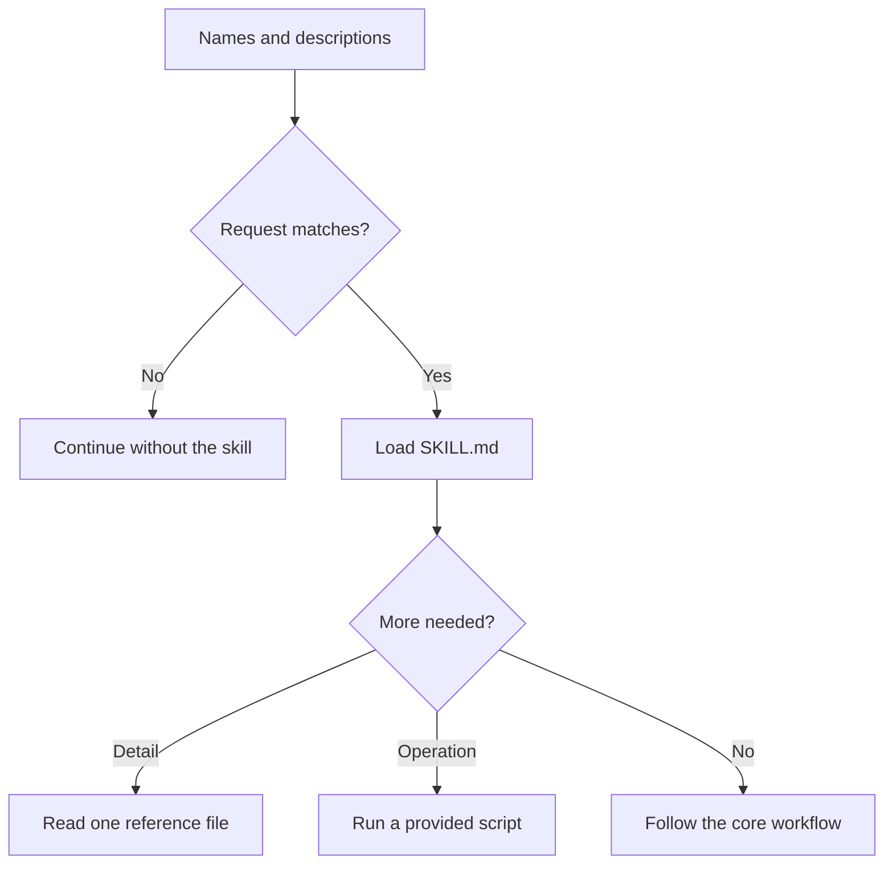

A skill is a folder of instructions that Claude Code loads only when a request matches its description. This page covers what a skill is and when to write one, how progressive disclosure keeps unused skills from costing context, and the `SKILL.md` file format.

## What a skill is

An agent skill is a folder of instructions, plus optional resources, that teaches Claude Code how to handle one kind of task. Its required `SKILL.md` starts with frontmatter holding a `name` and a `description`, followed by the instructions.[^claude-agent-skills-course]

### How a skill gets used

At startup Claude Code scans the skill locations but loads only names and descriptions. It compares each request with those descriptions by meaning, not by an exact command string, and loads a matching skill on demand. The description is therefore both discovery metadata and the main trigger. How the rest of the skill stays out of context until needed is covered under [Progressive disclosure](#progressive-disclosure).

After adding, editing, or removing a skill, restart Claude Code before testing, and test with several realistic phrasings rather than the words copied from the description.[^claude-agent-skills-course]

### When a skill is the right tool

Good candidates are repeated, task-specific procedures: code-review checklists, commit formats, brand guidance, documentation templates, framework-specific debugging. Having to explain the same task repeatedly is the course's signal that a skill may be worthwhile.[^claude-agent-skills-course] Rules that always apply belong in `CLAUDE.md` instead; see [Claude Code extension mechanisms](extension-mechanisms.md).

### Where skills live and who wins a name clash

| Scope | Location | Use |
| --- | --- | --- |
| Personal | `~/.claude/skills/<skill-name>/SKILL.md` | Preferences and workflows across projects |
| Project | `.claude/skills/<skill-name>/SKILL.md` | Repository standards shared through version control |

When two skills share a name, precedence is enterprise managed, then personal, then project, then plugin. Specific names such as `frontend-review` avoid clashes better than `review`.[^claude-agent-skills-course]

### Sharing

| Audience | Method |
| --- | --- |
| One repository or team | Commit `.claude/skills` to Git |
| Several repositories or the community | Package as a plugin in a marketplace |
| Whole organization | Enterprise managed settings (highest priority) |

Sharing methods as described in the course.[^claude-agent-skills-course]

Skills are not limited to Claude Code: an agent in [Claude Managed Agents](claude-managed-agents.md) bundles skills alongside its model, system prompt, tools, and MCP servers.[^claude-managed-agents]

In [Claude Code GitHub Actions](github-integration.md#claude-code-github-actions), repository skills need `actions/checkout` so `.claude/skills/` exists on the runner, and plugin skills must be installed through `plugin_marketplaces` and `plugins` first.[^claude-github-actions]

### Skills are files

Because a skill is a plain file, it can be versioned, shared, and even edited by another agent: Warp's [self-improving skill loop](../ai-engineering/self-improving-skill-loop.md) has a scheduled agent propose edits to a skill through pull requests.[^warp-self-improving-agents] In a sales rollout, a top performer's routine written once as a skill can be provisioned into the team bundle, and updating the file updates it for everyone.[^ai-native-revenue-org] The AI-native SDLC playbook puts organization-wide policy in skills rather than in an ever-growing repository `CLAUDE.md`.[^ai-native-sdlc-playbook]

### Troubleshooting

Run the Agent Skills validator first to rule out structural problems, then match the symptom:[^claude-agent-skills-course]

| Symptom | Likely cause | First fix |
| --- | --- | --- |
| Does not trigger | Description does not overlap real requests | Add phrases users actually say |
| Does not load | Wrong directory, filename, or YAML | Put `SKILL.md` in a named skill directory; inspect `claude --debug` |
| Wrong skill activates | Descriptions too similar | Make scope and trigger language distinct |
| Personal skill ignored | Higher-priority skill has the same name | Check precedence; rename |
| Plugin skill absent | Cache, install, or plugin structure | Validate, clear cache, restart, reinstall |
| Runtime failure | Missing dependency, permission, bad path | Install requirements, `chmod +x` scripts, use forward slashes |

## Progressive disclosure

Progressive disclosure means showing the model a cheap summary first and loading detail only once the task justifies it. For [agent skills](#what-a-skill-is), discovery costs only a name and description; the full `SKILL.md`, and then any references or scripts, enter context later.[^claude-agent-skills-course]



Each step down the chart costs more context, and each is taken only when the step above says so.

### Applying it to a skill

- Keep the essential workflow in `SKILL.md`; the course recommends under 500 lines.
- Move conditional detail to `references/`, `scripts/`, or `assets/`, and say in `SKILL.md` when to read or run each.
- Prefer scripts for operations: Claude runs a tested script and only its output enters context, not its source.[^claude-agent-skills-course]

## Skill configuration

An [agent skill](#what-a-skill-is) is a directory named after the skill containing `SKILL.md`: YAML frontmatter, then the instructions Claude follows once the skill is loaded.[^claude-agent-skills-course]

### Fields

| Field | Required | Guidance |
| --- | --- | --- |
| `name` | Yes | Lowercase letters, numbers, hyphens; at most 64 characters; same as the directory name |
| `description` | Yes | At most 1,024 characters; what the skill does and when to use it, in words users actually say |
| `allowed-tools` | No | Restricts tools for read-only or sensitive workflows (see [Least-privilege tool access](subagents.md#least-privilege-tool-access)) |
| `model` | No | Selects a model for the skill |

`name` identifies the skill, `description` decides when it matches, and the body says what to do.[^claude-agent-skills-course]

### Layout

```text
my-skill/
├── SKILL.md
├── references/
├── scripts/
└── assets/
```

Why the supporting folders exist is explained under [Progressive disclosure](#progressive-disclosure).

### Example

```markdown
---
name: pr-description
description: Writes pull request descriptions. Use when creating or summarizing a pull request.
---

When writing a PR description:

1. Inspect the complete branch diff.
2. Explain what changed and why.
3. List the concrete changes and any renamed or deleted files.
```

## Related

- [Subagent](subagents.md#what-a-subagent-is): subagents do not inherit skills.
- [Context isolation](subagents.md#context-isolation) saves context by moving work elsewhere; progressive disclosure saves it by not loading material until needed. (Analysis: this link is the wiki's own comparison, not a claim from either source.)
- [Subagent configuration file](subagents.md#subagent-configuration-file): the parallel format for subagents, which can list skills to preload.

[^claude-agent-skills-course]: [Introduction to Claude Code Agent Skills (study guide)](../../sources/claude-agent-skills-course.md), [original](https://github.com/kelvinlee97/engineering/blob/main/Claude/agent-skills/README.md)
[^claude-managed-agents]: [Claude Managed Agents](../../sources/claude-managed-agents.md), [original](https://github.com/kelvinlee97/engineering/blob/main/Claude/managed-agents/README.md)
[^claude-github-actions]: [Claude Code GitHub Actions](../../sources/claude-github-actions.md), [original](https://github.com/kelvinlee97/engineering/blob/main/Claude/github-actions/README.md)
[^warp-self-improving-agents]: [How Warp Builds Self-Improving Agents on Claude](../../sources/warp-self-improving-agents.md), [original](https://github.com/kelvinlee97/engineering/blob/main/Claude/self-improving-agents/README.md)
[^ai-native-revenue-org]: [Building an AI-Native Revenue Organization](../../sources/ai-native-revenue-org.md), [original](https://github.com/kelvinlee97/engineering/blob/main/Claude/ai-native-revenue-org/README.md)
[^ai-native-sdlc-playbook]: [The AI-Native SDLC Playbook](../../sources/ai-native-sdlc-playbook.md), [original](https://github.com/kelvinlee97/engineering/blob/main/Claude/ai-native-sdlc-playbook/README.md)
