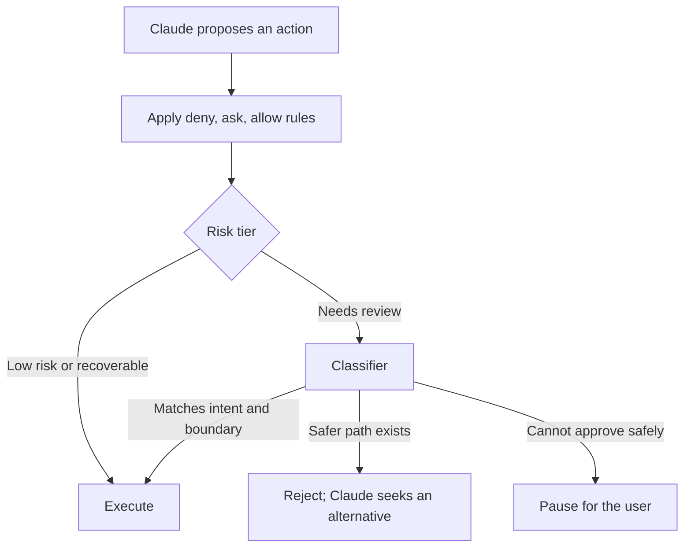

Auto Mode is a Claude Code permission mode that runs low-risk actions without asking and sends higher-risk ones to a separate classifier. Prompt injection, instructions hidden in content the agent reads, is one of the main threats that classifier is built to contain, so both are covered here.

## How Auto Mode works

Auto Mode lets low-risk work continue without prompts while a separate classifier checks higher-risk actions against what the user asked for, the configured rules, and the environment boundary. Claude does not approve its own actions.[^claude-auto-mode]

### Why it exists

Anthropic reports that about 97% of Claude Code permission prompts in its research were eventually approved. Approving every action gives control but causes approval fatigue and interrupts long multi-step tasks.[^claude-auto-mode]

### How an action is decided

The approximate order is: apply the `deny`, `ask`, and `allow` rules; determine the risk tier; send the action to the classifier if required; then execute, find a safer alternative, or pause. Searching, reading files, and editing inside the project usually skip the classifier; shell commands, web fetches, access outside the environment, and destructive operations are more likely to reach it.

The classifier sees the user's messages and Claude's proposed tool calls, but not Claude's reasoning, its replies, or tool output, which reduces the bias of one model being both executor and reviewer. For example, deleting remote branches is denied when the user asked only for local cleanup; a denied force push to `main` may become a push to a new branch; repeated denials pause for the user.[^claude-auto-mode]

### Configuring the trust boundary

By default only the working directory and Git remotes count as internal. The `environment` field describes trusted resources (GitHub organizations, cloud accounts or buckets, internal services, staging) in plain English. Setting it replaces the built-in entries, so include the default string to keep them. Administrators can set organization-wide managed values that developers can add to but not remove.

Classifier guidance comes as `allow`, `soft deny` (deny unless explicitly requested), and `hard deny` (deny even when requested). These guide the classifier and are not deterministic; hard enforcement stays with permission rules, covered on [Least-privilege tool access](subagents.md#least-privilege-tool-access).[^claude-auto-mode]

### What it is not

Not Claude approving itself, not removal of permission controls, not unconditional execution, not a replacement for production review, and not an absolute defense against [prompt injection](#prompt-injection).[^claude-auto-mode]

### Rollout guidance from the source

Start narrow, define the real environment boundary, keep explicit `deny` and `ask` rules, watch what gets denied, widen gradually, keep human review for production infrastructure, and build evaluations for your own environment. Actions the note says should keep explicit approval include `terraform apply`, production Kubernetes changes, cloud resource deletion, IAM changes, force-pushing protected branches, secrets, destructive SQL, and production DNS, TLS, or network-policy changes.[^claude-auto-mode]

## Prompt injection

Prompt injection is when content an agent reads (web pages, source files, tool results) carries hidden instructions meant to pull it away from the user's original request.[^claude-auto-mode] Any agent that reads text it did not write is exposed.

### Defenses described in the sources

| Setting | Defense |
| --- | --- |
| Claude Code [Auto Mode](#how-auto-mode-works) | A server-side probe scans tool results and flags suspicious instructions, and the classifier checks that Claude's next action still matches the user's intent; an attack has to pass both. |
| [Claude Code GitHub Actions](github-integration.md#claude-code-github-actions) | Treat issue text, comments, and changed repository content as untrusted input; grant only the needed permissions and tools; require human review and branch protection before merging.[^claude-github-actions] |

Anthropic reports that prompt-injection attack success fell to zero in its evaluations with both the probe and Auto Mode on. The note stresses this is Anthropic's internal evaluation, not a guarantee for every environment.[^claude-auto-mode]

## Related

- [Least-privilege tool access](subagents.md#least-privilege-tool-access): limits what a successful injection can do.

[^claude-auto-mode]: [How Claude Code Auto Mode Works](../../sources/claude-auto-mode.md), [original](https://github.com/kelvinlee97/engineering/blob/main/Claude/auto-mode/README.md)
[^claude-github-actions]: [Claude Code GitHub Actions](../../sources/claude-github-actions.md), [original](https://github.com/kelvinlee97/engineering/blob/main/Claude/github-actions/README.md)
