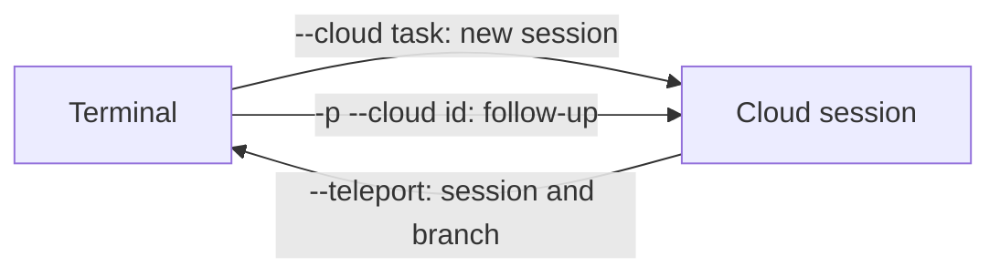

A cloud session is a Claude Code session that runs on an Anthropic-managed VM instead of your machine. This page covers what a session is and how it differs from a local one, the environment that configures its network and setup, and the commands that move work between your terminal and the cloud.

## What a cloud session is

A cloud session is an ordinary Claude Code session whose machine is not yours: an Anthropic-managed VM that clones your repository from GitHub, keeps running after you close the laptop, and can be picked up later from a browser, a phone, or your own terminal. Because the machine is not yours, the code has to come from GitHub (see [Claude GitHub App](github-integration.md#claude-github-app)) and network and secrets need their own policy (see [Cloud environment](#cloud-environment)).[^claude-cloud-sessions]

### Where one can start

| Surface | How to start |
| --- | --- |
| Browser | claude.ai/code (Claude Code on the web) |
| Mobile | The **Code** tab in the Claude app |
| Desktop app | Choose **Cloud** instead of **Local** |
| Terminal | `claude --cloud "<task>"` |
| Routines | Each scheduled or triggered run is a cloud session |

The starting surface changes nothing about how the session runs. A session running on your own machine and steered from a phone is Remote Control, a different feature; `--remote-control` does not create a cloud session.[^claude-cloud-sessions] Moving work in and out of the cloud is covered under [Moving work between terminal and cloud](#moving-work-between-terminal-and-cloud).

### Differences from a local session

- Commands that produce text work; terminal-only ones such as `/plugin` and `/resume` do not. Picker commands such as `/model` take their value as an argument (`/model sonnet`), which needs Claude Code v2.1.205+ in the environment.
- `/compact` and `/context` work; `/clear` does not, so start a new session instead.
- Cloud sessions set `CLAUDE_AUTOCOMPACT_PCT_OVERRIDE` themselves, and it overrides the same variable in your environment; to change compaction, set `CLAUDE_CODE_AUTO_COMPACT_WINDOW` instead.
- [Subagents](subagents.md#what-a-subagent-is) work as they do locally, and `.claude/agents/` definitions are picked up. Agent teams are off unless `CLAUDE_CODE_EXPERIMENTAL_AGENT_TEAMS=1` is set.
- To change a setting, set an environment variable on the environment or commit it to `.claude/settings.json`; `/config` in the browser only opens the settings panel.[^claude-cloud-sessions]

### Lifecycle and sharing

A session expires after inactivity and the VM is reclaimed. Reopening it restores the history on a fresh VM, but background work such as subagents and shell commands is not restored. A session also counts as inactive while it waits for you to approve an MCP tool call or sign in to an MCP server.

Sharing differs by plan: Team and Enterprise choose Private or Team with repository access verification on by default; Pro and Max choose Private or Public (any logged-in claude.ai user) with verification off by default. Sessions can contain private code and credentials, so check before sharing.[^claude-cloud-sessions]

### Limits

- Rate limits are shared with all other Claude usage on the account; there is no separate VM charge.
- Cloning and pull requests need GitHub. Other remotes can be sent as a bundle but results cannot be pushed back.
- An organization IP allowlist makes Anthropic-hosted sessions fail with an authentication error, because they call the API from Anthropic's network.
- Organizations with Zero Data Retention cannot use cloud sessions.[^claude-cloud-sessions]

## Cloud environment

A cloud environment is a saved configuration that every [cloud session](#what-a-cloud-session-is) runs inside. It controls three things: network access, environment variables, and setup scripts.[^claude-cloud-sessions]

### Defaults

With no environment yet, onboarding sets up a **Default** environment with **Trusted** network access, creating it or prompting you depending on plan. The same environments apply to every surface, plus Claude Tag and routines; Claude Tag channel sessions use organization-level environments only.

The network policy is the setting most likely to surprise: a blocked domain simply cannot be reached, and the failure shows up inside the session as a proxy `403` or an egress-blocked error, not as a configuration warning.[^claude-cloud-sessions]

### Anthropic-hosted versus self-hosted

Sessions can run in a self-hosted environment on your own infrastructure, which moves several guarantees to you:

| Layer | Anthropic-hosted | Self-hosted |
| --- | --- | --- |
| Isolation | One Anthropic-managed VM per session | Your deployment's responsibility |
| Network | Limited by default, can be disabled; a default allowed-domain list applies | You restrict egress at your own boundary |
| Git credentials | Kept outside the sandbox; a proxy authenticates with scoped credentials | Supplied by your deployment |
| API credentials | On Pro and Max, keys stay outside the sandbox and are attached after requests leave it | Not available (nor yet on Team or Enterprise) |

Even with network access disabled, Claude Code can still reach the Anthropic API, which may allow data to leave the VM: disabled network is not an air gap.[^claude-cloud-sessions]

## Moving work between terminal and cloud

From the CLI, work moves between your terminal and a [cloud session](#what-a-cloud-session-is) along three supported paths. The CLI cannot push a running terminal session up to the cloud; the Desktop app's **Continue in** menu can.[^claude-cloud-sessions]

### Terminal to cloud: `--cloud`

`claude --cloud "<task>"` clones your current directory's GitHub remote at the current branch, not your local checkout, so push local commits first. It handles one repository per call; `--remote` is a deprecated alias. Two patterns from the documentation: plan locally in plan mode, commit the plan, then execute it with `--cloud`; and start several `--cloud` sessions to run tasks in parallel.

With no git remote, or on a github.com repository without the [Claude GitHub App](github-integration.md#claude-github-app), Claude Code uploads a bundle of the local repository instead of cloning, even if you connected with `/web-setup`. The bundle holds full history and uncommitted changes to tracked files; `CCR_FORCE_BUNDLE=1` forces it.

| Bundle constraint | Behaviour |
| --- | --- |
| Repository | Git repository with at least one commit |
| Size | Under 100 MB; larger falls back to the current branch, then a squashed snapshot, then fails |
| Untracked files | Not included |
| Pushing back | Only with push access through your GitHub connection |

On macOS, Linux, and WSL, uncommitted changes to credential-shaped files (`.env`, `*.tfvars`, `id_rsa`, `*.pem`) are left out and named. In a linked worktree, submodule, or similar layout that protection does not apply.[^claude-cloud-sessions]

### Follow-ups: `claude -p "<message>" --cloud <session-id>`

This posts one message and exits. It sends no local session state, so it can run from any machine. `--output-format json` returns `{ok, session_id, url}` or `{ok: false, session_id, error}`. Running `--cloud <session-id>` without `-p` fails with "Attaching to an existing cloud session is not enabled for your account", and a third-party provider such as Bedrock or Vertex blocks cloud sessions until it is unset.[^claude-cloud-sessions]

### Cloud to terminal: `--teleport`

`claude --teleport`, `/teleport` (or `/tp`), `/tasks` then `t`, and **Open in > Terminal** all check out the session's branch and load its history locally. The terminal gets its own copy; nothing flows back to the cloud session. `--teleport` is not `--resume`, which lists only local history.

| Requirement | Detail |
| --- | --- |
| Clean git state | No uncommitted changes (you are offered a stash) |
| Same repository | Not a fork |
| Branch pushed | The session's branch must exist on the remote |
| Same account | The claude.ai account that owns the session |

*Source for this section.*[^claude-cloud-sessions]

### Analysis from the source

The note's author concludes that because the handoff is one-way, you should decide at the start whether a task runs locally or in the cloud, using a committed plan file as the bridge.[^claude-cloud-sessions]

## Related

- [Pull request auto-fix](github-integration.md#pull-request-auto-fix)
- [Claude Projects](claude-projects.md): each project thread runs as a cloud session, and local-only workflows are not supported.[^claude-projects]
- [Least-privilege tool access](subagents.md#least-privilege-tool-access)

[^claude-cloud-sessions]: [Claude Code Cloud Sessions](../../sources/claude-cloud-sessions.md), [original](https://github.com/kelvinlee97/engineering/blob/main/Claude/cloud-sessions/README.md)
[^claude-projects]: [Claude Projects, Redesigned](../../sources/claude-projects.md), [original](https://github.com/kelvinlee97/engineering/blob/main/Claude/projects/README.md)
