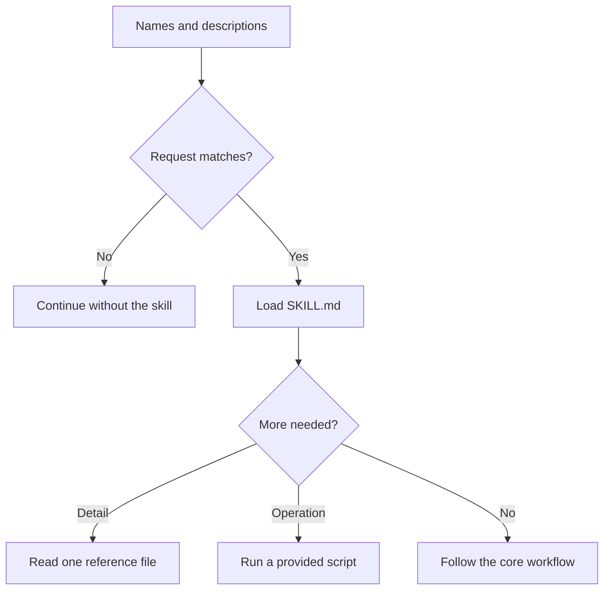

Progressive disclosure means showing the model a cheap summary first and loading detail only once the task justifies it. For [agent skills](agent-skill.md), discovery costs only a name and description; the full `SKILL.md`, and then any references or scripts, enter context later.[^claude-agent-skills-course]

Each step down the chart costs more context, and each is taken only when the step above says so.

## Applying it to a skill

- Keep the essential workflow in `SKILL.md`; the course recommends under 500 lines.[^claude-agent-skills-course]
- Move conditional detail to `references/`, `scripts/`, or `assets/`, and say in `SKILL.md` when to read or run each.[^claude-agent-skills-course]
- Prefer scripts for operations: Claude runs a tested script and only its output enters context, not its source.[^claude-agent-skills-course]

## Related

- [Context isolation](context-isolation.md) saves context by moving work elsewhere; progressive disclosure saves it by not loading material until needed. (Analysis: this link is the wiki's own comparison, not a claim from either source.)
- Source: [Introduction to Claude Code Agent Skills](../../sources/claude-agent-skills-course.md)

[^claude-agent-skills-course]: Introduction to Claude Code Agent Skills (study guide)
