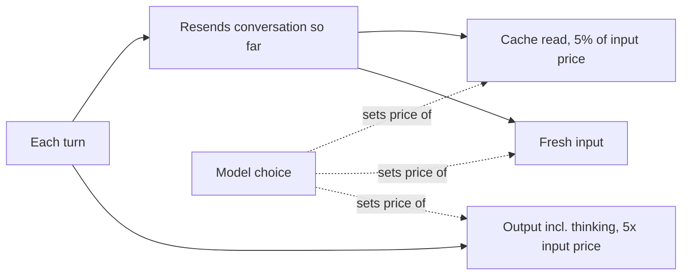

A Claude Code task is a loop: the model reads the conversation, calls a tool, reads the result, and repeats until done. What you pay depends less on the price per token than on how many times the loop runs and how much of each request comes from cache. This page covers what drives that cost, what Opus 5.5 changed, and the settings that move the bill. Most dollar figures here are the source's illustrations at API list prices, not measurements.

The source's framing: every way to spend fewer tokens (lower effort, a smaller model, less context) can also cost you a finished task, and a retry costs more than those savings.[^opus-5-5-task-cost]

## What sets the cost of a task

| Driver | Why it matters |
| --- | --- |
| Turns | Every turn resends the conversation so far, so a turn costs more than the tokens it adds. |
| Cache reads | Most of what a turn resends was seen last turn and is billed as a cache read, a small fraction of the input price. |
| Output tokens | Five times the input price. Thinking is billed as output, even when Claude Code shows only a summary. |
| Model | Each model has its own prices, so the choice sets the price of every token. |

Worked example at Opus 5.5 list prices ($4 per million input, $20 per million output, $0.20 per million cache reads): a task that starts at 20K tokens of context and grows to 120K over 40 turns sends about 2.8M input tokens. At a 90% cache hit rate that input costs about $1.62; with no cache it would cost $11.20; at 96% about $0.99. The same task in 25 turns processes about 1.75M tokens and costs about $1.02 in input. The 60K output tokens of a typical task cost $1.20, as much as reading 6M tokens from cache.

Two habits cut turns: give the model a way to check its work (a test, a build, a script that calls the endpoint), and let it gather what it needs in one pass with batched tool calls.[^opus-5-5-task-cost]

## What Opus 5.5 changed

| Price per million tokens (API list) | Opus 5.5 | Change from Opus 5 |
| --- | --- | --- |
| Input | $4 | 20% lower |
| Output | $20 | 20% lower |
| Cache read | $0.20 | 60% lower |

The cache-read rate falls from a tenth of the input price to a twentieth. On Pro, Max, and Team plans the lower price is passed on to limits, so they go about 25% further than on Opus 5; the extra cache-read cut is an API price change only. Five-hour limits also went up on Pro, Max, Team, and seat-based Enterprise plans, with a one-time limit reset under Settings > Usage on the web or Claude Desktop.

The post's illustrative session (2.0M cache reads, 200K fresh input, 60K output) costs $3.50 on Opus 5 and $2.40 on Opus 5.5, about 31% less from price alone. At 10 tasks a day over 22 working days, that is $242 less a month. A cache-heavy session can save up to 60% on input; a short uncached question with a long answer saves up to 20%.

The widely quoted "40% less to run" is Anthropic's estimate for typical workloads at default settings. It assumes Opus 5.5 also uses fewer tokens per task at its medium default, so it is not a 40% cut in token price. Opus 5.5 always thinks before replying and can use more tokens on an answer; the gap should be largest on open-ended tasks where a model can spend many turns on a wrong idea. Long runs also end with a report of what changed and what it needs from you.[^opus-5-5-task-cost]

## Effort levels

Effort sets how many tokens the model spends per turn on thinking, text, and tool calls. Opus 5.5 has low, medium, high, and xhigh, plus max for a single session. Set it with `/effort <level>`; `/effort status` shows the current level.

| Level | Use it for |
| --- | --- |
| low | Mechanical work: renames, applying a known pattern across files |
| medium | Well-scoped daily work; the Opus 5.5 default |
| high | When medium stalls |
| xhigh, max | Hard problems where you have measured a gain |

Opus 5.5 defaults to medium, one level below Opus 5's default of high, and thinks more per turn than Opus 5 at the same level. Do not carry over a level chosen for Opus 5.

The break-even: if high adds 20K thinking tokens to a task, that is $0.40 on Opus 5.5, about the cost of one ten-turn retry loop at 100K of cached context. High pays for itself on a task where it saves one retry and is wasted on a task medium would have finished.

The clearest sign you need more effort is a fix that stops at one layer: at medium the model renames a field in an API handler, its tests pass, and the client still sends the old field. Before raising effort, check whether a test through the client would catch it; a test run costs one turn, while more effort adds thinking to every turn.

With an API key or a Claude subscription, changing effort mid-session keeps the cache. On Amazon Bedrock, Google Cloud's Agent Platform, or a Claude apps gateway, it clears the cache and the next request pays the write price on everything.[^opus-5-5-task-cost]

## Choosing a model

Model choice moves the bill more than effort, and every [subagent](subagents.md) that inherits the main model inherits its price.

| Model | Use it for |
| --- | --- |
| Sonnet or Haiku | Lookups: search-and-summarize subagents, reading logs and test output, "where is this defined" |
| Opus 5.5 | Work you supervise: features across a few files, debugging, review with follow-up edits; mechanical multi-file edits at low effort |
| Fable 5.1 | Long unsupervised runs, problems with no existing pattern, large changes coordinating many subagents |

Fable 5.1 lists at $10 per million input and $50 per million output, two and a half times Opus 5.5, but its cache reads cost $0.25 per million, only 1.25 times the Opus 5.5 rate. The gap is smallest on long cache-heavy runs. The source's rule: if Opus 5.5 on xhigh hits the same problem twice, switch, then switch back once solved. Switch at a natural break, since the new model starts with an empty cache; `/compact` first to shrink that write. `/model` also saves the choice as the default for new sessions.

To put a subagent on a smaller model, set `model: haiku` or `model: sonnet` in its definition, or set `CLAUDE_CODE_SUBAGENT_MODEL` for all of them; a model named in the definition wins. Agent teams (experimental) use about seven times the tokens of a standard session when teammates run in plan mode. Keep small models on work where a mistake is cheap to spot; a misread search result sends the main model after the wrong file. The `opusplan` alias does the opposite (Opus plans, Sonnet edits), so measure it before making it a default.

When migrating, instructions written for an older model can make Opus 5.5 write more and repeat tool calls. `/claude-api prompt-audit` checks skills and CLAUDE.md for these patterns. On one internal benchmark of 44 support tickets, moving from Opus 4.8 to Opus 5.5 at low effort cut cost by about 18%, and the audit cut a further 9%, to about 25% below the starting point.[^opus-5-5-task-cost]

## Caching and compaction

The cache stores a prefix of the request (system prompt, tool definitions, conversation), so it only reuses what matches the previous request from the start. On Opus 5.5 a cache read costs 5% of fresh input; a write costs 1.25 times input for a five-minute cache and twice input for a one-hour cache. Each hit resets the lifetime. In Claude Code the lifetime is an hour on a subscription and five minutes on an API key or cloud provider, or once a subscription draws on usage credits.

At 120K tokens of context a five-minute write costs about $0.60 and a read about $0.02, so one write costs as much as 25 reads. On an API key, a six-minute break turns the next read into a write.

Expect a cache write when you pause past the lifetime, switch models, compact, connect or disconnect an MCP server, turn on fast mode for the first time, or change effort on a cloud provider or gateway. Set these up at the start of a session and leave them alone.

Long sessions cost more per turn even with a warm cache: a turn's cache read costs about $0.004 at 20K tokens of context and about $0.03 at 150K.

| Command | Cost | When |
| --- | --- | --- |
| `/clear` | Free | Moving to unrelated work |
| `/compact` | About $0.25 at 150K, pays back in about ten turns | At a natural break, before a pause (warm cache); say what to keep |
| `/rewind` | Returns to an already-cached prefix | Dropping a wrong path while the cache is warm |

Compacting after a break longer than the cache lifetime rereads everything; at 150K tokens on a five-minute cache the input alone is about $0.75. Compaction also loses detail, such as the one log line that mattered.

Keep CLAUDE.md under 200 lines, since every session loads it and every turn resends it. MCP tool definitions are deferred until used, but disconnect servers you are not using (`/mcp`). Fast mode runs Opus 5.5 up to 2.5 times faster at twice the price ($8 input, $40 output per million), and the first request after enabling it pays full input price on the whole conversation, so turn it on at the start.[^opus-5-5-task-cost]

## Measuring your own sessions

- Run `/usage` (or `/cost`) at the end of a task. The Session block shows tokens and an estimated list-price cost; on a subscription it is a guide, not a bill.
- Run the same real task on Opus 5 and Opus 5.5 (Claude Code v2.1.280 or later) and compare turns, output tokens, and cost across three or four tasks.
- For teams, the Claude Code Analytics API gives estimated cost per user, and the Usage and Cost API splits spend by model and cached versus uncached tokens.

When reading `/usage`, check three things: cache share (low on a long session means a pause, model switch, mid-session MCP change, or effort change on a gateway), output against input (a lot of output on a small change means effort is too high or the model is retrying), and total input against conversation size (a large multiple means many turns). As a baseline, enterprise deployments average about $13 per developer per active day, and 90% of users stay below $30.[^opus-5-5-task-cost]

## Related

- [Subagents](subagents.md): the delegation mechanism whose model setting decides what each subagent's spend costs.
- [Claude Code extension mechanisms](extension-mechanisms.md): CLAUDE.md and MCP servers, both of which load into every turn.
- [Cloud sessions](cloud-sessions.md): where long-running Claude Code sessions run.

[^opus-5-5-task-cost]: [What a task costs on Opus 5.5 (summary)](../../sources/opus-5-5-task-cost.md), [original](https://github.com/kelvinlee97/engineering/blob/main/raw/2026-09-25-what-a-task-costs-on-opus-5-5.md)
