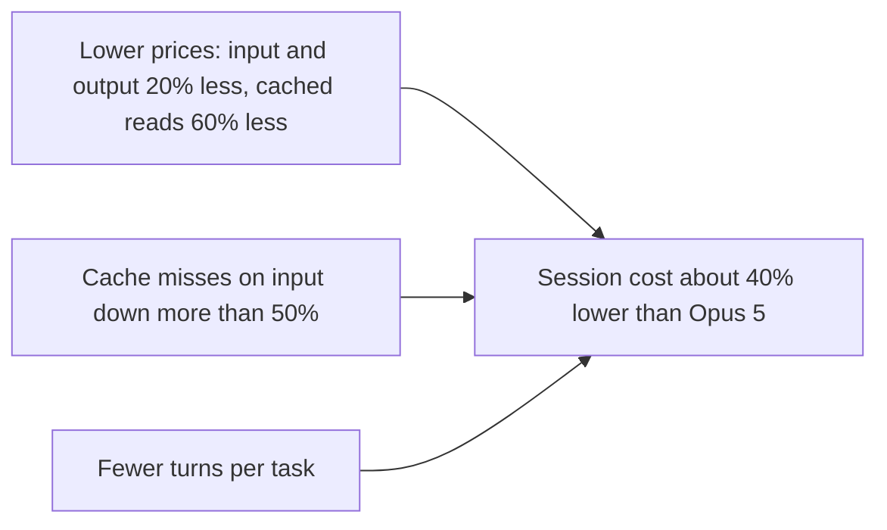

This page explains what a long Claude Code session costs and why. Each model call resends the whole conversation as input; prompt caching (the API storing an already-seen prefix of the input so later calls read it at a lower price) turns most of that resent input into cheap cached reads. So the bill of an agentic session depends mostly on cache hits, the cached-read price, and how many turns the task takes.

## How coding sessions changed

Anthropic reports these shifts in Claude Code usage between March and September 2026:

| Measure | Change |
| --- | --- |
| Work per prompt | 3.3x longer, with more than 40% more model calls per prompt |
| Interruptions | 68% fewer |
| Context per request | 2.6x larger |
| Input-to-output token ratio | 189:1 → 324:1 |
| Use of connected tool servers or skills | twice as likely |

With input now outweighing output by hundreds to one, cached token reads make up the majority of agentic work costs.[^claude-opus-5-5-context]

## Where the savings come from

The post credits three changes for Claude Opus 5.5 costing about 40% less to run than Opus 5 on typical token-billed workloads, with the largest savings in long, high-context sessions.

- **Price.** Input and output tokens cost 20% less and cached reads 60% less. Anthropic says a cached token costs a fifth of what competing models charge.
- **Cache hits.** Uncached input fell by more than 50%. Accidental login resets no longer clear the cache, changing the effort level no longer resets it, and subagents start from the parent's cache instead of paying again for the same context.
- **Fewer turns.** Opus 5.5 finishes tasks, especially open-ended ones, in fewer turns than earlier models, and generates output over 30% faster than Opus 5.[^claude-opus-5-5-context]

## Keeping the cache warm

The post's recommendations, each aimed at keeping reads cached:

1. Run `/usage` in Claude Code to watch cached reads.
2. Choose the model at the start of a session. (Analysis: the post does not say why; a cache is tied to one model, so switching mid-session likely means rebuilding it.)
3. On API keys or cloud providers, set a one-hour cache lifetime for long sessions.[^claude-opus-5-5-context]

## Related

- [Subagents](subagents.md#what-it-costs): delegation cost, now reduced by sharing the parent's cache.
- [Claude Code cloud sessions](cloud-sessions.md): where long-running sessions run.
- [Claude Code extension mechanisms](extension-mechanisms.md): the skills and MCP servers whose growing use adds context.

[^claude-opus-5-5-context]: [Claude Opus 5.5 and longer coding sessions](../../sources/claude-opus-5-5-context.md), [original](https://github.com/kelvinlee97/engineering/blob/main/raw/2026-09-25-claude-opus-5-5-context.md)
