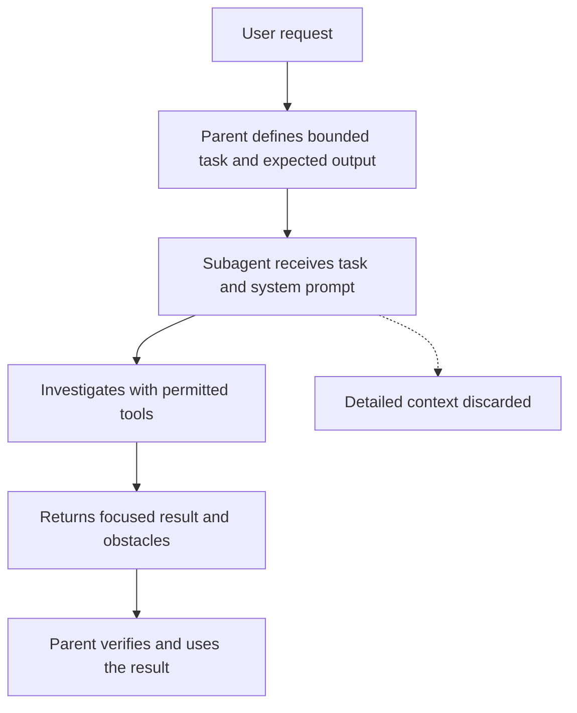

A subagent is a specialized assistant that Claude Code delegates one task to. It works in a separate conversation, returns a short summary to the main conversation (the parent), and its own conversation is then discarded.[^claude-subagents-course]

## How it runs

A subagent receives two inputs: a system prompt from its [configuration file](subagent-configuration.md), which defines its role, and a task description the parent writes from the user's request.[^claude-subagents-course] Its file reads, searches, edits, and tool results stay in its own context; the parent keeps only the original request and the returned summary.[^claude-subagents-course] Why that matters, and what it costs, is on [Context isolation](context-isolation.md).

The parent only ever sees the result box, so the [delegation contract](delegation-contract.md) has to say what that result contains.

## Built-in and custom subagents

| Subagent | Purpose in the course |
| --- | --- |
| General purpose | Multi-step tasks that need both exploration and action |
| Explore | Fast searching and navigation of codebases |
| Plan | Codebase research and analysis during plan mode |

Claude Code also supports custom subagents with their own system prompts and tool access.[^claude-subagents-course]

## Example

To find which service handles refunds in an unfamiliar codebase, Claude might read around 15 files, run searches, and trace function calls. Done in the main conversation, all of that lands in its context although the wanted output is one fact; an Explore subagent keeps the investigation isolated and returns only the answer.[^claude-subagents-course]

## Related

- [When to delegate](when-to-delegate.md): the decision rule and the anti-patterns.
- [Least-privilege tool access](least-privilege-tool-access.md): which tools a subagent should get.
- Source: [Introduction to Claude Code Subagents](../../sources/claude-subagents-course.md)

[^claude-subagents-course]: Introduction to Claude Code Subagents (study guide)
