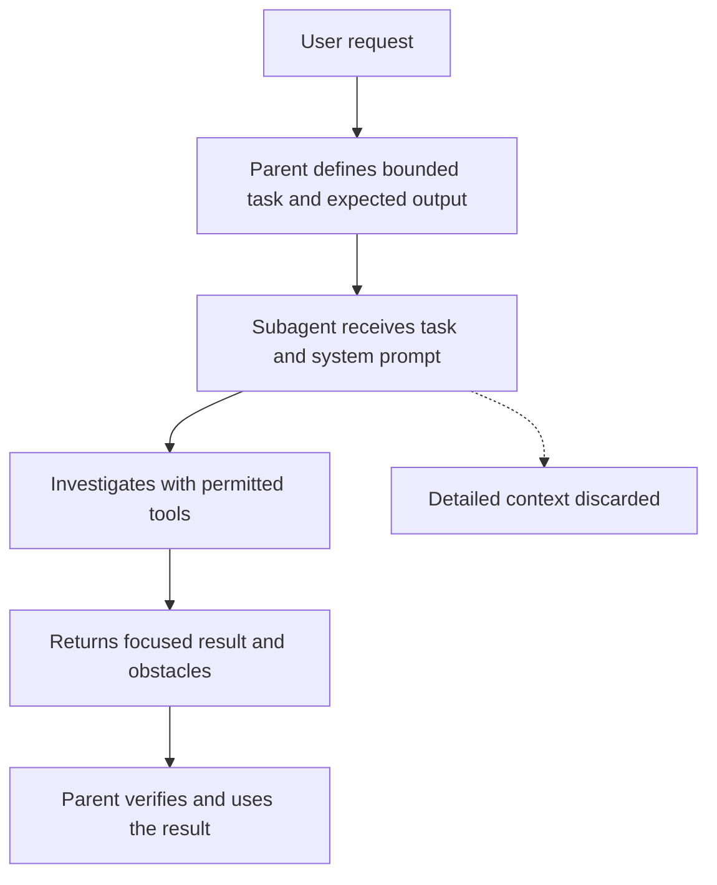

A subagent is a worker agent that Claude Code hands one bounded task to. It runs in its own context and returns only a short result, so the main conversation stays clean at the cost of not seeing how the result was reached. This page covers what a subagent is, when delegating pays off, how to write the task and choose its tools, and the file that defines one.

## What a subagent is

A subagent is a specialized assistant that Claude Code delegates one task to. It works in a separate conversation, returns a short summary to the main conversation (the parent), and its own conversation is then discarded.[^claude-subagents-course]

### How it runs

A subagent receives two inputs: a system prompt from its [configuration file](#subagent-configuration-file), which defines its role, and a task description the parent writes from the user's request. Its file reads, searches, edits, and tool results stay in its own context; the parent keeps only the original request and the returned summary.[^claude-subagents-course] Why that matters, and what it costs, is covered under [Context isolation](#context-isolation).



The parent only ever sees the result box, so the [delegation contract](#delegation-contract) has to say what that result contains.

### Built-in and custom subagents

| Subagent | Purpose in the course |
| --- | --- |
| General purpose | Multi-step tasks that need both exploration and action |
| Explore | Fast searching and navigation of codebases |
| Plan | Codebase research and analysis during plan mode |

Claude Code also supports custom subagents with their own system prompts and tool access.[^claude-subagents-course]

### Subagents and skills

Subagents do not inherit the main conversation's [skills](agent-skills.md#what-a-skill-is). Built-in agents cannot use skills at all; a custom subagent can, but only the ones listed in its frontmatter, and those load when the subagent starts rather than matching on demand.[^claude-agent-skills-course] The `skills` field is described under [Subagent configuration file](#subagent-configuration-file). Where subagents sit among Claude Code's other mechanisms is on [Claude Code extension mechanisms](extension-mechanisms.md).

Subagents also work in [cloud sessions](cloud-sessions.md#what-a-cloud-session-is) as they do locally, and `.claude/agents/` definitions are picked up automatically.[^claude-cloud-sessions]

### Example

To find which service handles refunds in an unfamiliar codebase, Claude might read around 15 files, run searches, and trace function calls. Done in the main conversation, all of that lands in its context although the wanted output is one fact; an Explore subagent keeps the investigation isolated and returns only the answer.[^claude-subagents-course]

## Context isolation

Context isolation means running noisy intermediate work (file reads, searches, tool output) somewhere other than the main conversation, so only the conclusion comes back. In Claude Code, a [subagent](#what-a-subagent-is) is the mechanism.

### What it protects

Every exchange and tool result uses up the main context window (the finite amount of text the model can hold at once). A large investigation can fill it with material that is no longer useful; moving that exploration into a separate context keeps the main one clear.[^claude-subagents-course]

### What it costs

The parent loses visibility into how the conclusion was reached and into anything discovered but left out of the summary. Two consequences follow in the course:

- The result must be specified in advance, including obstacles, or the main thread has to rediscover them. See [Delegation contract](#delegation-contract).
- Chains of dependent steps lose information at each handoff, so they belong in one context. See [When to delegate](#when-to-delegate).[^claude-subagents-course]

### A side benefit: fresh context

A reviewer subagent starts without the conversation history that produced the code, so it can review more critically than the main conversation that helped write it.[^claude-subagents-course]

## When to delegate

The course reduces the choice to one question: **does the intermediate work matter to the main thread?** If only the final result matters, delegate to a [subagent](#what-a-subagent-is); if the main thread must see or react to what is found along the way, keep the work there.[^claude-subagents-course]

### Where delegation works

| Use case | Why it fits |
| --- | --- |
| Research and exploration, such as locating JWT validation in an unfamiliar codebase | Many files searched, one location and explanation returned |
| Code review | Fresh context without the creation history; the system prompt can encode project review standards |
| Tasks that need a different system prompt: copywriting (audience, tone, voice), styling (design-system files loaded first) | The difference comes from the instructions and context, which the main conversation lacks[^claude-subagents-course] |

### Anti-patterns

| Anti-pattern | Why it fails |
| --- | --- |
| Empty expert personas ("Python expert") | The main conversation already has that knowledge; isolation helps only with a real difference such as a custom prompt, focused context, or controlled tools |
| Sequential pipelines of dependent steps (reproduce → debug → fix) | Each handoff compresses away discoveries the next step needs; pipelines suit only independent tasks |
| Test-runner subagents | Diagnosis needs full failure output, and a summary like "tests failed" hides it; the course reports this pattern performed worse among the configurations tested[^claude-subagents-course] |

All three are cases of [context isolation](#context-isolation) costing more than it saves.

## Delegation contract

Because the parent sees only the returned summary ([context isolation](#context-isolation)), everything it needs back has to be agreed before the work starts. The course names four characteristics of an effective subagent: a specific description, structured output, obstacle reporting, and limited tool access.[^claude-subagents-course] The last one is covered under [Least-privilege tool access](#least-privilege-tool-access).

### The description does two jobs

The name and description of every available subagent are placed in the main agent's system prompt, and the parent uses them to decide which subagent to launch and when. The description also shapes the task prompt the parent writes: a vague reviewer description can produce "find the current changes", while a stronger one can require the parent to name the exact files. Requiring citable sources in a research subagent's description carries that requirement into the delegated prompt.

To make automatic use more likely, the course suggests including "proactively" and concrete trigger examples in the description. If delegation does not trigger as expected, improve the description rather than the system prompt.[^claude-subagents-course]

Skills are selected the same way: Claude matches the request against each skill's description, so a description needs the words users actually say.[^claude-agent-skills-course] See [Agent skill](agent-skills.md#what-a-skill-is).

### A defined output is the biggest improvement

The course calls a defined output format the most important improvement: it acts as a checklist and gives a natural stopping point. Without it, a research subagent may not know when it has learned enough. A code review output could be: summary, critical issues, major issues, minor issues, recommendations, approval status, obstacles encountered.[^claude-subagents-course]

### The same idea for whole tasks

The GH-600 course applies the contract to agent tasks on GitHub: each task needs inputs (issue context, repository scope, explicit constraints), outputs (a pull request with a structured plan, a bounded changeset, and evidence links), and success criteria that reflect the real intent, such as "vulnerability resolved" rather than just "tests passed". Criteria can be enforced as a required status check.[^gh-600-study-notes] See [Agents propose, people and policy accept](../ai-engineering/ai-native-sdlc.md#agents-propose-people-and-policy-accept).

### Obstacles are part of the result

If a subagent finds a workaround or quirk and leaves it out, the main thread must rediscover it. The output format should ask for:[^claude-subagents-course]

- setup issues and environment quirks;
- workarounds discovered during the task;
- commands that needed special flags or configuration;
- dependencies or imports that caused problems.

## Least-privilege tool access

Least privilege means starting from what an agent must do and granting only the tools that job requires. Both Claude Code courses apply it: subagents through their `tools` list, skills through `allowed-tools`.[^claude-agent-skills-course] For subagents, the course gives two reasons: fewer unintended side effects, and a clearer responsibility for each subagent.[^claude-subagents-course]

### Tools by role

| Subagent role | Course-recommended access |
| --- | --- |
| Research, read-only | `Glob`, `Grep`, `Read` |
| Code reviewer | Read tools plus `Bash` for commands such as `git diff`; no edit or write |
| Styling or code modification | Add edit and write, because modification is the job |

The `/agents` creation screen groups tools as read-only, edit, execution, MCP, and other. A reviewer normally needs to read, may still use execution to inspect pending changes, and should not get edit or write access.[^claude-subagents-course] The chosen list is stored in the `tools` field of the [subagent configuration file](#subagent-configuration-file).

### Rules versus guidance

Claude Code permission rules are the deterministic layer: `deny` blocks matching tool calls, `ask` requires confirmation even in [Auto Mode](auto-mode.md#how-auto-mode-works), and `allow` permits them. Auto Mode's classifier guidance (`allow`, `soft deny`, `hard deny`) only steers the classifier and is not enforcement. Broad rules that allow arbitrary code execution may still be reviewed by the classifier.[^claude-auto-mode]

The AI-native SDLC playbook states the same split as a principle: use deterministic checks for enforcement and agents for judgment or diagnosis.[^ai-native-sdlc-playbook]

### Beyond a single agent

- Prefer tool allowlists over wildcards; give planning and review agents read-only tools and reserve write and execution tools for implementation agents.
- Treat adding or widening an MCP server as a reviewable, high-risk change, because it directly widens what an agent can reach.
- Inject secrets at runtime only into the components that need them; an agent's runtime does not automatically inherit repository CI secrets.
- Give workflows minimal permissions by default, such as `contents: read` and `pull-requests: write`.[^gh-600-study-notes]
- Give automated jobs their own identity, narrow permissions, short-lived credentials, and no standing production access.[^ai-native-sdlc-playbook]

### In cloud identity

AWS IAM applies the same idea: temporary credentials through roles and federation instead of long-term keys, starting from AWS managed policies and narrowing, and IAM Access Analyzer to generate least-privilege policies from actual CloudTrail activity.[^aws-iam] See [IAM policy evaluation](../aws/iam.md#iam-policy-evaluation).

### Layers multiply

In [Claude Code GitHub Actions](github-integration.md#claude-code-github-actions), effective capability is the intersection of actor checks, the job's GitHub `permissions`, and the tools Claude may invoke; granting a tool in one layer does nothing if another withholds it.[^claude-github-actions]

### Skills: `allowed-tools`

While a [skill](agent-skills.md#what-a-skill-is) is active, `allowed-tools` limits which tools are available without asking for extra permission. A read-only onboarding skill might allow `Read`, `Grep`, `Glob`, and `Bash` and leave out editing tools. Leaving the field out keeps Claude's normal permission model. Restrict tools only when the workflow needs that boundary.[^claude-agent-skills-course]

## Subagent configuration file

A custom [subagent](#what-a-subagent-is) is one Markdown file: YAML frontmatter for its settings, then a body that is its system prompt. Project-level subagents are typically stored at `.claude/agents/<name>.md`.[^claude-subagents-course]

### Creating one with /agents

1. Run `/agents` and choose **Create new agent**.
2. Choose a scope: project-level (this project only) or user-level (all projects on the machine).
3. Configure it by hand, or describe the behaviour and let Claude generate the name, description, and system prompt. The course recommends generating as the easier start.
4. Select tools, model, and UI colour.
5. Save the generated file.
6. Test on a representative task; if delegation does not trigger, refine the description.[^claude-subagents-course]

### Fields

| Field | Role |
| --- | --- |
| `name` | Unique identifier; also usable as `@agent <name>` |
| `description` | Tells Claude when to delegate and shapes the delegated prompt; one line, with escaped `\n` for breaks |
| `tools` | The tools the subagent may use (see [Least-privilege tool access](#least-privilege-tool-access)) |
| `model` | `haiku` (fast, light tasks), `sonnet` (middle ground), `opus` (complex analysis), or `inherit` (use the main conversation's model) |
| `color` | UI cue for which subagent is active |
| Body | The system prompt: focus, method, reporting |

Fields as described in the course.[^claude-subagents-course]

A custom subagent can also take a `skills` field listing [skills](agent-skills.md#what-a-skill-is) to load when it starts, for example `skills: accessibility-audit, performance-check`. The listed skills must already exist in an available skills directory; this suits isolated work that must apply a fixed, named set of standards.[^claude-agent-skills-course]

### Example

```markdown
---
name: code-quality-reviewer
description: Review specified code changes for quality and risk.
tools: Bash, Glob, Grep, Read
model: sonnet
color: purple
---

Review only the files named in the delegated task. Report findings by
severity and include enough evidence for the parent agent to verify them.
```

What to write in `description` and the body is covered under [Delegation contract](#delegation-contract).

## Contradictions

The two sources name the built-in agents differently:

- The subagents course lists General purpose, Explore, and Plan.[^claude-subagents-course]
- The skills course, when saying built-in agents cannot access skills, names Explorer, Plan, and Verify.[^claude-agent-skills-course]

Neither source explains the difference. Check the current Claude Code documentation before relying on either list.

## Related

- [Progressive disclosure](agent-skills.md#progressive-disclosure): saving context by not loading material until needed.
- [Skill configuration](agent-skills.md#skill-configuration): where `allowed-tools` is set, and the matching file format for skills.
- [Claude Code extension mechanisms](extension-mechanisms.md): where subagents sit among CLAUDE.md, skills, hooks, and MCP.

[^claude-subagents-course]: [Introduction to Claude Code Subagents (study guide)](../../sources/claude-subagents-course.md), [original](https://github.com/kelvinlee97/engineering/blob/main/Claude/subagents/README.md)
[^claude-agent-skills-course]: [Introduction to Claude Code Agent Skills (study guide)](../../sources/claude-agent-skills-course.md), [original](https://github.com/kelvinlee97/engineering/blob/main/Claude/agent-skills/README.md)
[^claude-cloud-sessions]: [Claude Code Cloud Sessions](../../sources/claude-cloud-sessions.md), [original](https://github.com/kelvinlee97/engineering/blob/main/Claude/cloud-sessions/README.md)
[^gh-600-study-notes]: [GitHub Certified: Agentic AI Developer (study notes)](../../sources/gh-600-study-notes.md), [original](https://github.com/kelvinlee97/engineering/blob/main/Claude/github-agentic-ai-developer/README.md)
[^claude-auto-mode]: [How Claude Code Auto Mode Works](../../sources/claude-auto-mode.md), [original](https://github.com/kelvinlee97/engineering/blob/main/Claude/auto-mode/README.md)
[^claude-github-actions]: [Claude Code GitHub Actions](../../sources/claude-github-actions.md), [original](https://github.com/kelvinlee97/engineering/blob/main/Claude/github-actions/README.md)
[^ai-native-sdlc-playbook]: [The AI-Native SDLC Playbook](../../sources/ai-native-sdlc-playbook.md), [original](https://github.com/kelvinlee97/engineering/blob/main/Claude/ai-native-sdlc-playbook/README.md)
[^aws-iam]: [AWS IAM - Runbook & Reference](../../sources/aws-iam.md), [original](https://github.com/kelvinlee97/engineering/blob/main/AWS/iam/README.md)
