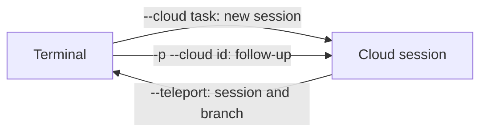

From the CLI, work moves between your terminal and a [cloud session](cloud-session.md) along three supported paths. The CLI cannot push a running terminal session up to the cloud; the Desktop app's **Continue in** menu can.[^claude-cloud-sessions]

## Terminal to cloud: `--cloud`

`claude --cloud "<task>"` clones your current directory's GitHub remote at the current branch, not your local checkout, so push local commits first. It handles one repository per call; `--remote` is a deprecated alias.[^claude-cloud-sessions] Two patterns from the documentation: plan locally in plan mode, commit the plan, then execute it with `--cloud`; and start several `--cloud` sessions to run tasks in parallel.[^claude-cloud-sessions]

With no git remote, or on a github.com repository without the [Claude GitHub App](claude-github-app.md), Claude Code uploads a bundle of the local repository instead of cloning, even if you connected with `/web-setup`. The bundle holds full history and uncommitted changes to tracked files; `CCR_FORCE_BUNDLE=1` forces it.[^claude-cloud-sessions]

| Bundle constraint | Behaviour |
| --- | --- |
| Repository | Git repository with at least one commit |
| Size | Under 100 MB; larger falls back to the current branch, then a squashed snapshot, then fails |
| Untracked files | Not included |
| Pushing back | Only with push access through your GitHub connection |

On macOS, Linux, and WSL, uncommitted changes to credential-shaped files (`.env`, `*.tfvars`, `id_rsa`, `*.pem`) are left out and named. In a linked worktree, submodule, or similar layout that protection does not apply.[^claude-cloud-sessions]

## Follow-ups: `claude -p "<message>" --cloud <session-id>`

This posts one message and exits. It sends no local session state, so it can run from any machine. `--output-format json` returns `{ok, session_id, url}` or `{ok: false, session_id, error}`.[^claude-cloud-sessions] Running `--cloud <session-id>` without `-p` fails with "Attaching to an existing cloud session is not enabled for your account", and a third-party provider such as Bedrock or Vertex blocks cloud sessions until it is unset.[^claude-cloud-sessions]

## Cloud to terminal: `--teleport`

`claude --teleport`, `/teleport` (or `/tp`), `/tasks` then `t`, and **Open in > Terminal** all check out the session's branch and load its history locally. The terminal gets its own copy; nothing flows back to the cloud session.[^claude-cloud-sessions] `--teleport` is not `--resume`, which lists only local history.[^claude-cloud-sessions]

| Requirement | Detail |
| --- | --- |
| Clean git state | No uncommitted changes (you are offered a stash) |
| Same repository | Not a fork |
| Branch pushed | The session's branch must exist on the remote |
| Same account | The claude.ai account that owns the session |

[^claude-cloud-sessions]

## Analysis from the source

The note's author concludes that because the handoff is one-way, you should decide at the start whether a task runs locally or in the cloud, using a committed plan file as the bridge.[^claude-cloud-sessions]

## Related

- Source: [Claude Code Cloud Sessions](../../sources/claude-cloud-sessions.md)

[^claude-cloud-sessions]: Claude Code Cloud Sessions
