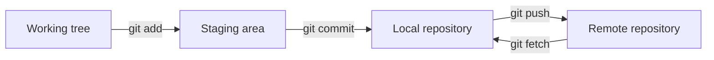

Everyday Git is moving work between four places: the working tree, the staging area, the local repository, and a remote. This page explains those places, the commands that move and inspect work between them, a commit workflow, and why secrets must never be committed.

## Git's four places

Almost every everyday Git command either inspects or moves content between four places: the working tree, the staging area, the local repository, and a remote repository.

| Place | What it holds |
| --- | --- |
| Working tree | The files you see and edit |
| Staging area (index) | The exact content prepared for the next commit |
| Local repository | Commit history on this machine; `HEAD` normally marks the current branch's latest commit |
| Remote repository | For example `origin`; `origin/main` is your *local record* of it, only as fresh as your last `fetch` |

As defined in the operations reference.[^git-operations-reference] `git init` creates the hidden `.git/` directory that holds the local repository; before that, Git does not know the folder exists.[^git-tutorial-00-init]

### Moving and inspecting

`git add` moves chosen changes into the staging area, `git commit` records them in history, `git push` publishes, and `git fetch` updates remote-tracking branches without touching your files.[^git-operations-reference] The staging area exists so you can split mixed changes into separate, clean commits, such as a bug fix and a docs update.[^git-tutorial-02-add]

`git diff` compares the working tree with the staging area; `git diff --staged` compares the staging area with the last commit; `git diff HEAD` skips the distinction.[^git-tutorial-06-diff]

### Divergence

When local and remote history have both moved on from a common commit, Git cannot guess whether you want a merge or a rebase, so it asks for an explicit strategy.[^git-operations-reference] See [Syncing a Git branch](branches-and-pull-requests.md#syncing-a-git-branch).

## Basic commands

The seven commands a beginner uses daily, in the order they usually come up.

| Command | Does | Useful flags | Pitfall |
| --- | --- | --- | --- |
| `git init` | Turns a folder into a repository | `-b main` sets the initial branch; `--bare` for a server-side remote | Never delete `.git` and re-init an existing repo; do not init in `~` |
| `git clone` | Copies a remote repository with all history and records it as `origin` | `--branch`, `--depth 1` (shallow), `--recurse-submodules` | A shallow clone lacks history; `git fetch --unshallow` before rebase or full `log` |
| `git add` | Stages chosen changes | `-p` per hunk, `-u` tracked files only, `-A` whole repo | `git add .` can catch `.env` files; re-add a file edited after staging |
| `git status` | Shows branch, staged, unstaged, untracked | `-s`: left column is staging area, right is working tree | Read-only, so run it often |
| `git commit` | Records the staging area as a snapshot with a hash | `-m`, `-a` (tracked files only), `--amend` | Never amend a commit others already pulled; use `git revert` |
| `git log` | Shows history, newest first | `--oneline`, `--graph --all`, `-p`, `--stat`, `--follow -- file` | Press `q` to leave the pager |
| `git diff` | Shows exact line changes | `--staged`, `--stat`, `--word-diff` | Check `--staged` before committing so debug code does not slip in |

Collected from the seven chapters.[^git-tutorial-00-init][^git-tutorial-01-clone][^git-tutorial-02-add][^git-tutorial-03-status][^git-tutorial-04-commit][^git-tutorial-05-log][^git-tutorial-06-diff]

### Reading `git status -s`

`??` is untracked, ` M` modified but not staged, `M ` staged, `MM` staged then modified again, `A ` a new staged file, and ` D` deleted but not staged.[^git-tutorial-03-status]

### Commit messages

The tutorial recommends the Conventional Commits style: a type such as `feat`, `fix`, or `docs`, then a short imperative description under 50 characters, with an optional body explaining why.[^git-tutorial-04-commit] The GitHub guide adds a caution: follow the repository's existing style and do not add prefixes unless the project uses Conventional Commits.[^git-publish-guide]

## Commit workflow

A safe commit is a short loop of look, stage precisely, look again, commit, confirm.

1. `git diff` to see what actually changed.
2. `git add path/to/file` with explicit paths, so unrelated files stay out; the GitHub guide calls this safer for beginners than `git add .`.
3. `git diff --staged` to review exactly what the commit will contain; forgetting it is how debug calls and temporary code slip into commits.[^git-tutorial-06-diff]
4. `git commit`, which creates local history only.
5. `git show --stat HEAD` to confirm the commit and its scope.

Before pushing, confirm the branch and target with `git branch --show-current`, `git branch -vv`, and `git remote -v`, then push to an explicit remote and branch.[^git-operations-reference]

If you staged the wrong file, `git restore --staged path/to/file` keeps the edit but removes it from the next commit.[^git-publish-guide]

## Keeping secrets out of Git

Tokens, private keys, `.env` files, `kubeconfig`, cloud credentials, production backups, and customer data never belong in a commit.[^git-operations-reference]

### Why cleanup does not work

- `.gitignore` only affects files that are not yet tracked; adding a rule does not remove a committed file.
- `git rm --cached` stops tracking a file from now on, but leaves it in history and does not invalidate a leaked credential.[^git-operations-reference]
- Making a repository private after pushing a secret does not make the secret safe.[^git-publish-guide]

### If a credential leaks

Revoke or rotate it first, then assess access logs and exposure, and only then use the platform's approved history-cleanup process.[^git-operations-reference]

### Prevention

`git add .` will happily pick up `.env` files, so check `git status` before committing and add sensitive files to `.gitignore`.[^git-tutorial-02-add] Stage explicit paths and review `git diff --staged`.[^git-publish-guide]

## Related

- [GitHub pull request workflow](branches-and-pull-requests.md#github-pull-request-workflow)

[^git-operations-reference]: [Essential Git Commands for Operations](../../sources/git-operations-reference.md), [original](https://github.com/kelvinlee97/engineering/blob/main/Git/README.md)
[^git-tutorial-00-init]: [Git command-line basics: git init](../../sources/git-tutorial-00-init.md), [original](https://github.com/kelvinlee97/engineering/blob/main/Git/00-init/README.md)
[^git-tutorial-02-add]: [Git command-line basics: git add](../../sources/git-tutorial-02-add.md), [original](https://github.com/kelvinlee97/engineering/blob/main/Git/02-add/README.md)
[^git-tutorial-06-diff]: [Git command-line basics: git diff](../../sources/git-tutorial-06-diff.md), [original](https://github.com/kelvinlee97/engineering/blob/main/Git/06-diff/README.md)
[^git-tutorial-01-clone]: [Git command-line basics: git clone](../../sources/git-tutorial-01-clone.md), [original](https://github.com/kelvinlee97/engineering/blob/main/Git/01-clone/README.md)
[^git-tutorial-03-status]: [Git command-line basics: git status](../../sources/git-tutorial-03-status.md), [original](https://github.com/kelvinlee97/engineering/blob/main/Git/03-status/README.md)
[^git-tutorial-04-commit]: [Git command-line basics: git commit](../../sources/git-tutorial-04-commit.md), [original](https://github.com/kelvinlee97/engineering/blob/main/Git/04-commit/README.md)
[^git-tutorial-05-log]: [Git command-line basics: git log](../../sources/git-tutorial-05-log.md), [original](https://github.com/kelvinlee97/engineering/blob/main/Git/05-log/README.md)
[^git-publish-guide]: [Publish Changes to GitHub: A Beginner's Guide](../../sources/git-publish-guide.md), [original](https://github.com/kelvinlee97/engineering/blob/main/Git/publish-to-github/README.md)
