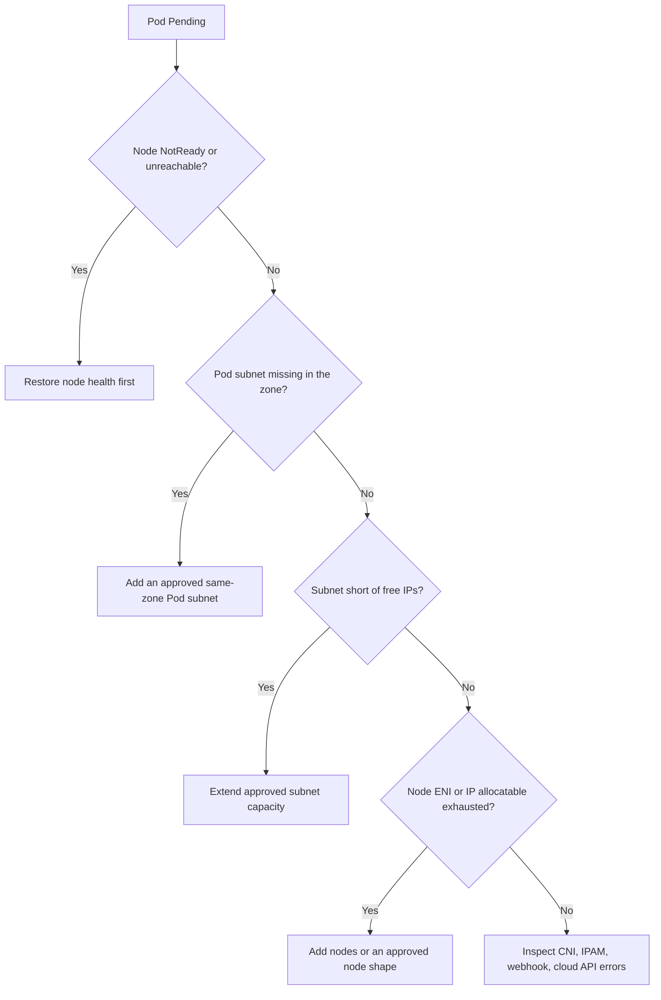

Use this when Pods stay `Pending` and scheduler events report `InsufficientIPOrENI`, an ENI/IP extended-resource shortage, or a missing Pod subnet in an ENI-based Kubernetes network (an ENI is an elastic network interface a node attaches to get more IP addresses). The source uses TKE VPC-CNI as its concrete example.

A `Pending` status alone does not establish IP exhaustion: if candidate nodes are `NotReady` or unreachable, that is a node-health problem first.[^k8s-ip-eni-runbook]

## Classify before changing anything

Several conditions can coexist; clear each one. Do not infer a cause from one event string: correlate scheduler events, node taints and readiness, subnet state, free IP count, extended-resource requests, and allocatable capacity.[^k8s-ip-eni-runbook]

## Evidence to collect (read-only)

- `kubectl get pods -A --field-selector=status.phase=Pending`, recent events, `kubectl describe pod` and `kubectl describe node`, and nodes with their zone label.
- The Pod's requested extended resources against the node's `allocatable`. On TKE VPC-CNI, the `tke-eni-ip-webhook` can add a request such as `tke.cloud.tencent.com/eni-ip`; confirm the real keys in the cluster.
- Through the approved console or API: subnet association, node and subnet zones, remaining IPs, ENI and secondary-IP limits for the instance type, and CNI/IPAM health.[^k8s-ip-eni-runbook]

## Remediate in dependency order

1. **Node health.** Follow the node-health runbook; an unreachable-node toleration is not a substitute for recovery.
2. **Pod subnet.** Add a subnet only if it belongs to the cluster VPC, is meant for Pods, is in the affected zone, does not overlap Node, Pod, or Service ranges, and the CNI/IPAM components have seen it.
3. **Node headroom.** If the subnet has free addresses but node allocatable is exhausted, scale the node pool or change instance type through the approved workflow; then schedule a low-risk test workload in the zone before touching production.
4. **IPAM and admission.** When capacity looks healthy, inspect components such as `tke-eni-ipamd` and `tke-eni-agent` without restarting them blindly, and escalate cloud-API failures.

Restart only affected workloads, after checking replicas, update strategy, and PodDisruptionBudgets. The source notes that direct deletion of Pods or Deployments can bypass PDBs, so they are one input, not a safety guarantee.[^k8s-ip-eni-runbook]

## Prevention

Monitor per availability zone, not only cluster-wide: free IPs per Pod subnet, ENI/IP allocatable versus requested per node pool, Pending Pods by reason and zone, and IPAM or cloud-API errors.[^k8s-ip-eni-runbook]

## Related

- [Layered troubleshooting](../operations/incident-operations.md#layered-troubleshooting)
- [Incident closure criteria](../operations/incident-operations.md#incident-closure-criteria)

[^k8s-ip-eni-runbook]: [Kubernetes IP or ENI Exhaustion Scheduling Failure Runbook](../../sources/k8s-ip-eni-runbook.md), [original](https://github.com/kelvinlee97/engineering/blob/main/Kubernetes/runbooks/insufficient-ip-or-eni/README.md)
