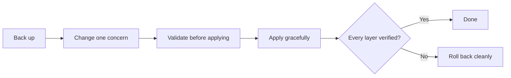

Three practices recur across every runbook in this wiki: troubleshoot one layer at a time, change production through a small reversible loop, and close an incident only when stated evidence holds. Each is described once here and linked from the runbooks.

## Layered troubleshooting

Layered troubleshooting treats a failure as one broken link in a chain the request or workload depends on. You collect read-only evidence, walk the chain in order, and act only on the first broken link. All four operational sources in this wiki follow it.

| Source | The chain it walks |
| --- | --- |
| Kubernetes IP or ENI exhaustion | Node health, Pod subnet presence, subnet free IPs, node ENI/IP allocatable, IPAM and admission components[^k8s-ip-eni-runbook] |
| Express BFF incidents | Gateway, PM2 and BFF process, route and app logic, downstream dependency, host resources[^express-bff-incidents-runbook] |
| Nginx and OpenResty deployments | Configuration test, port ownership, upstream, file permissions, request mapping, ACME[^nginx-production-guide][^openresty-production-guide] |

### Rules the sources share

- **Evidence before action.** Start with read-only commands and preserve evidence before changing processes, releases, routes, credentials, or downstream targets.
- **One symptom is not a cause.** A `Pending` Pod does not establish IP exhaustion, and one event string is not enough; correlate several signals.[^k8s-ip-eni-runbook] A downstream `4xx/5xx` is not proof the BFF is broken.
- **Liveness is not health.** ZooKeeper's `ruok` answering `imok` only proves the process is bound to its port, not that it is in quorum, and freeing disk space does not repair a truncated transaction log.[^zookeeper-disk-full-runbook] Likewise an open port is not an application acceptance test.
- **A restart is not a diagnosis.** A restart can restore service temporarily without proving the root cause.[^express-bff-incidents-runbook]
- **Do not widen the blast radius.** Raising timeouts before finding the failing layer, `chmod -R 777`, or restarting everything are listed as things not to do.[^nginx-production-guide]

## Safe change procedure

The sources in this wiki apply production changes with the same loop: record intent, back up, make one small change, validate before applying, apply gracefully, verify, and keep a way back.

### The loop

1. **Record intent and back up.** Back up the file, configuration, or release being changed.
2. **Change one concern.** One small edit at a time.[^openresty-production-guide]
3. **Validate before applying.** For packages, `apt-get -s` simulates the change so the plan can be read before anything is installed or removed; the APT guide calls this simulation the step that protects you from held versions, phased rollouts, and locks.[^ubuntu-apt-guide] For servers and releases: `nginx -t` or `openresty -t` before any reload; for a release, `npm ci`, tests, and `node --check` in the new release directory before switching.
4. **Apply gracefully.** A reload validates the new configuration and then gracefully replaces workers, which is safer than a routine restart; PM2 `reload` does the same for cluster workers.
5. **Verify each layer.** Health, an approved real request, and logs, not just an open port.
6. **Roll back cleanly.** Restore the backup and test it before reloading, or repoint `current` to the known-good release.[^nginx-production-guide][^express-bff-deployment-guide]

### One member at a time in a quorum system

For a replicated system the loop gains a stop rule. The ZooKeeper guide changes one member, waits for it to rejoin, checks all three members, and continues only if there is still one leader and two followers; otherwise it stops and rolls back that one member. Two members are never changed at once, because three members tolerate only one failure.[^zookeeper-production-guide]

### Restarts are a decision, not a reflex

The Kubernetes runbook says adding capacity does not justify restarting every workload: restart only the affected one, after checking replicas, update strategy, and PodDisruptionBudgets, and with the service owner's approval.[^k8s-ip-eni-runbook]

## Incident closure criteria

An incident is closed against explicit acceptance evidence, not because the alert stopped. Both incident runbooks in this wiki end with such a list.

### What the lists have in common

- **Every affected layer is shown healthy.** For Kubernetes: nodes `Ready`, a usable same-zone subnet, ENI/IP capacity no longer exhausted, a new Pod that schedules and gets an IP, DaemonSets at `DESIRED = CURRENT = READY`, and no new `InsufficientIPOrENI` events during the observation period. For the BFF: stable PM2 workers, private health, the gateway route, and a representative authorized flow.
- **Recovery of a dependency is not proof it was the only cause.** After rebuilding a ZooKeeper member, the runbook repeats the original dependent-service request rather than assuming the application is fixed.[^zookeeper-disk-full-runbook] After a quorum-loss restore, closure also needs matching `last_zxid` values on every member and application owners' approval of their ACL and dependency checks.[^zookeeper-quorum-loss-runbook]
- **An agreed observation period.** Health must hold over time, not at one moment.
- **The record separates facts from guesses.** Observed evidence, completed actions, and pending validation are kept apart; the first failing layer and the mitigation are recorded separately from hypotheses.
- **Sanitized records.** Environment identifiers, raw logs, and screenshots stay in the authorized incident system; follow-ups get an owner.[^k8s-ip-eni-runbook][^express-bff-incidents-runbook]

## Related
- [Domain index](index.md): other pages in this domain.

[^k8s-ip-eni-runbook]: [Kubernetes IP or ENI Exhaustion Scheduling Failure Runbook](../../sources/k8s-ip-eni-runbook.md), [original](https://github.com/kelvinlee97/engineering/blob/main/Kubernetes/runbooks/insufficient-ip-or-eni/README.md)
[^express-bff-incidents-runbook]: [Node.js / Express BFF: Ten Common Incidents Runbook](../../sources/express-bff-incidents-runbook.md), [original](https://github.com/kelvinlee97/engineering/blob/main/Nodejs/runbooks/common-express-bff-incidents/README.md)
[^nginx-production-guide]: [Nginx Production Deployment and Operations for Beginners](../../sources/nginx-production-guide.md), [original](https://github.com/kelvinlee97/engineering/blob/main/Nginx/guides/nginx-production-deployment/README.md)
[^openresty-production-guide]: [OpenResty Production Deployment and Operations for Beginners](../../sources/openresty-production-guide.md), [original](https://github.com/kelvinlee97/engineering/blob/main/Nginx/guides/openresty-production-deployment/README.md)
[^zookeeper-disk-full-runbook]: [ZooKeeper Disk-Full Recovery Runbook](../../sources/zookeeper-disk-full-runbook.md), [original](https://github.com/kelvinlee97/engineering/blob/main/ZooKeeper/runbooks/disk-full-transaction-log-recovery/README.md)
[^express-bff-deployment-guide]: [Node.js / Express BFF Production Deployment for Beginners](../../sources/express-bff-deployment-guide.md), [original](https://github.com/kelvinlee97/engineering/blob/main/Nodejs/guides/express-bff-production-deployment/README.md)
[^zookeeper-production-guide]: [ZooKeeper Production Deployment Guide for DevOps Beginners](../../sources/zookeeper-production-guide.md), [original](https://github.com/kelvinlee97/engineering/blob/main/ZooKeeper/guides/production-deployment/README.md)
[^ubuntu-apt-guide]: [Common Ubuntu APT Operations](../../sources/ubuntu-apt-guide.md), [original](https://github.com/kelvinlee97/engineering/blob/main/Ubuntu/apt/README.md)
[^zookeeper-quorum-loss-runbook]: [ZooKeeper Quorum-Loss Snapshot Restore Runbook](../../sources/zookeeper-quorum-loss-runbook.md), [original](https://github.com/kelvinlee97/engineering/blob/main/ZooKeeper/runbooks/quorum-loss-snapshot-restore/README.md)
