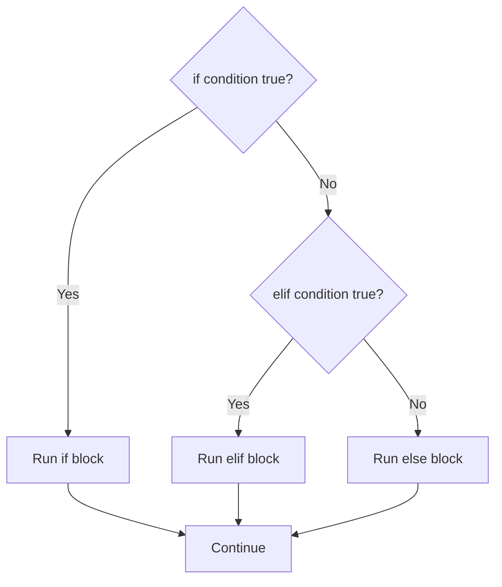

This page covers the Python a script needs every day: how names refer to objects, which built-in container to reach for, how branches and loops decide what runs, and how functions and comprehensions are written. Examples use operations data such as HTTP status codes.

## Names point at objects

A Python name is a label pointing at an object, not a box holding a value. Assigning one name to another copies the pointer, so both names share one object, and a change made through one is visible through the other when the object is mutable.

```python
first = [1, 2]
second = first
second.append(3)  # first is now [1, 2, 3]
```

`==` compares values and `is` compares identity; write `value is None`. The immutable basics are `int`, `float`, `bool`, `str`, `tuple`, and `frozenset`; the mutable ones are `list`, `dict`, and `set`.[^py-variables-and-types] Every string method returns a new string, since strings are immutable.[^py-strings]

Sharing causes three classic bugs:

- `[[0] * 3] * 2` creates two references to one inner list; build rows with `[[0] * 3 for _ in range(2)]`. `copy()` is shallow, so nested objects stay shared.[^py-lists]
- Default arguments are evaluated once, when the function is defined, so a mutable default is shared by every call. Default to `None` and create the object inside.[^py-functions]

## Choosing a collection

Pick the container whose order, mutability, and uniqueness match the data.[^py-tuples-and-sets]

| Type | Ordered | Mutable | Use |
| --- | --- | --- | --- |
| `list` | Yes | Yes | A resizable sequence |
| `tuple` | Yes | No | Fixed records and multiple return values; one item needs `(10,)` |
| `dict` | Insertion order | Yes | Hashable keys mapped to values |
| `set` | No | Yes | Unique hashable values; `set()` for empty, since `{}` is a dict |
| `str` | Yes | No | Text |

As described in the cheatsheets.[^py-lists][^py-dictionaries][^py-strings]

## Working with lists, dicts, sets, and strings

- **Lists.** Mutating methods (`sort`, `append`, `remove`) change the list and return `None`; `sorted()` and `copy()` build new lists. `remove()` raises `ValueError` for a missing value and indexing past the end raises `IndexError`, while slices stop quietly at the boundary.[^py-lists]
- **Dictionaries.** Use `mapping[key]` when a missing key is an error and `get()` or `setdefault()` when a default is valid. `a | b` merges (Python 3.9+). Equality ignores insertion order.[^py-dictionaries]
- **Sets.** `|`, `&`, `-`, and `^` give union, intersection, difference, and symmetric difference; `discard()` does not raise when the value is absent.[^py-tuples-and-sets]
- **Strings.** `split()` with no argument splits on any whitespace, `" | ".join(parts)` joins, `f"{service=}"` prints a name with its value, and raw strings such as `r"\d+"` keep backslashes literal.[^py-strings]

## Branches

An `if`/`elif`/`else` chain runs exactly one branch: the first true condition wins and later ones are never evaluated.



Empty strings and collections, zero, and `None` are false. Comparisons chain (`500 <= status < 600`), and `and`/`or` short-circuit with precedence `not`, `and`, `or`. A common bug is `status == 200 or 201`, which is always true; write `status in (200, 201)`. `match` (Python 3.10+) matches structure with `case _` as the fallback, but plain `if` is clearer for one or two conditions.[^py-control-flow]

## Loops

Iterate over values directly, with `enumerate` when you need indexes and `zip(..., strict=True)` (Python 3.10+) to catch inputs of different lengths. `range` excludes its stop value. A loop's `else` block runs only when the loop ends without `break`, which makes it a natural "not found" branch for a search. Never modify a list while iterating over it; build a new one.[^py-loops]

## Functions

A signature is a contract: positional parameters, keyword-only parameters after `*`, `*args`, `**kwargs`, and defaults each control how callers pass arguments. A function that reaches its end without `return` returns `None`.[^py-functions]

```python
def connect(host: str, port: int = 443, *, timeout: float = 5.0) -> str: ...
```

## Comprehensions

A comprehension is a loop written as an expression, `[expression for item in iterable if condition]`, and its brackets pick the result: `[]` a list, `{}` a set or dict, `()` a lazy generator expression. Nested comprehensions read in the same order as nested `for` loops; switch to a plain loop when nesting or conditions make one hard to scan.[^py-comprehensions] Laziness is covered under [generators](structure.md#iterators-and-generators).

## Related

- [Python program structure](structure.md)
- [SRE Python drills](sre-drills.md)
- [Domain index](index.md)

[^py-variables-and-types]: [Python Variables and Types Cheatsheet](../../sources/py-variables-and-types.md), [original](https://github.com/kelvinlee97/engineering/blob/main/Python/beginner/00-variables-and-types/README.md)
[^py-strings]: [Python Strings Cheatsheet](../../sources/py-strings.md), [original](https://github.com/kelvinlee97/engineering/blob/main/Python/beginner/01-strings/README.md)
[^py-lists]: [Python Lists Cheatsheet](../../sources/py-lists.md), [original](https://github.com/kelvinlee97/engineering/blob/main/Python/beginner/03-lists/README.md)
[^py-functions]: [Python Functions Cheatsheet](../../sources/py-functions.md), [original](https://github.com/kelvinlee97/engineering/blob/main/Python/beginner/07-functions/README.md)
[^py-tuples-and-sets]: [Python Tuples and Sets Cheatsheet](../../sources/py-tuples-and-sets.md), [original](https://github.com/kelvinlee97/engineering/blob/main/Python/beginner/06-tuples-and-sets/README.md)
[^py-dictionaries]: [Python Dictionaries Cheatsheet](../../sources/py-dictionaries.md), [original](https://github.com/kelvinlee97/engineering/blob/main/Python/beginner/05-dictionaries/README.md)
[^py-control-flow]: [Python Control Flow Cheatsheet](../../sources/py-control-flow.md), [original](https://github.com/kelvinlee97/engineering/blob/main/Python/beginner/02-control-flow/README.md)
[^py-loops]: [Python Loops Cheatsheet](../../sources/py-loops.md), [original](https://github.com/kelvinlee97/engineering/blob/main/Python/beginner/04-loops/README.md)
[^py-comprehensions]: [Python Comprehensions Cheatsheet](../../sources/py-comprehensions.md), [original](https://github.com/kelvinlee97/engineering/blob/main/Python/beginner/08-comprehensions/README.md)
