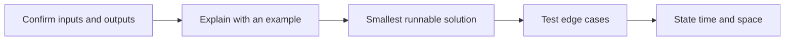

The index of the Python notes doubles as a drill set: small HackerRank-style SRE questions on a sample Nginx combined access log, each answered with the smallest correct algorithm and its stated time and space cost.

## The drills

| Drill | Technique | Cost |
| --- | --- | --- |
| Count 5xx requests | Stream the file line by line and read the status after the quoted request | `O(n)` time, `O(1)` space |
| Count each status | `dict.get(status, 0)`, then `sorted` by count | `O(n)` scan, `O(k log k)` sort |
| Top N paths | Split the quoted request into method, path, protocol; slice `[:n]` | `O(m)` scan, `O(k log k)` sort |
| Duplicate request IDs | A `seen` set and a `duplicates` set | `O(n)` average |
| Two Sum | A dictionary of complements | `O(n)` time and space |
| Maximum fixed-window count | Slide the window, adding the entering value and removing the leaving one | `O(n)` time, `O(1)` space |

As listed in the source.[^py-sre-drills]

## Answering in an interview

Confirm input, output, and invalid-input behavior; explain the algorithm on a small example; write the smallest runnable solution; test empty input, duplicates, no result, and boundaries; then state time and space complexity.[^py-sre-drills]

## Related

- [Text processing](../linux/text-processing.md): the same log parsing with awk and uniq.
- [Python language fundamentals](fundamentals.md)
- [Python program structure](structure.md)
- [Domain index](index.md)

[^py-sre-drills]: [Python SRE HackerRank Quick Reference](../../sources/py-sre-drills.md), [original](https://github.com/kelvinlee97/engineering/blob/main/Python/README.md)
