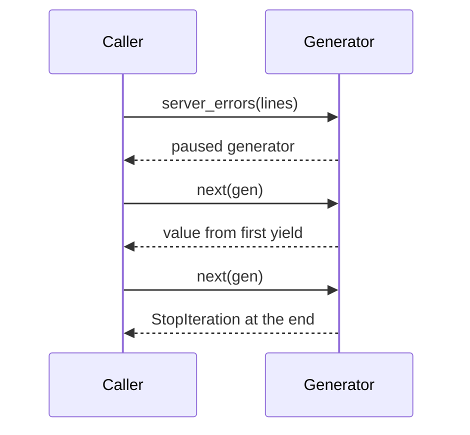
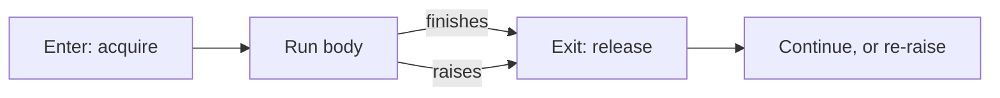

This page covers the tools for structuring Python once a script grows: lazy iteration, decorators, handling errors and releasing resources, organizing code into modules and classes, typing it, and testing it.

## Iterators and generators

An iterable produces an iterator, and an iterator yields one value at a time. Calling a generator function runs none of its body: it returns a paused object that runs up to the next `yield` each time a value is requested and raises `StopIteration` when it finishes.

Generator expressions such as `sum(n * n for n in values)` are lazy too. They suit streams and large inputs, but an iterator is normally consumed only once.[^py-iterators-and-generators]

## Decorators

`@trace` above `def deploy` is shorthand for `deploy = trace(deploy)`: the name is rebound to the wrapper that `trace` returns, so each call reaches the wrapper first, which then calls the original. Use `functools.wraps` so the wrapper keeps the original name and docstring, and prefer a direct call when the behavior is not shared across several functions.[^py-decorators]

## Exceptions

Exactly one of `except` or `else` runs, depending on whether an exception occurred, and `finally` always runs. Catch the narrowest expected exception, re-raise with context using `raise RuntimeError(...) from error`, never swallow errors silently, and avoid a bare `except:` unless you must also intercept process exit and cancellation.[^py-exceptions]

## Context managers and files

A `with` block runs the entry step, then the body, and then the exit step exactly once, even if the body raises.

Use `with` for files, locks, database transactions, and temporary state, and write small ones with `contextlib.contextmanager`, for example a transaction that commits after `yield` and rolls back on error.[^py-context-managers]

A `pathlib.Path` names a location and is not an open resource; opening is a separate step that `with` pairs with closing. Iterate over an open file for large inputs rather than calling `read_text()`. Mode `"w"` replaces content and `"a"` appends.[^py-files-and-paths]

## Modules and packages

A module is the namespace built from one `.py` file, and a package is built from a directory of modules. Importing runs the file once, which is why `if __name__ == "__main__":` separates "run directly" from "imported". Use absolute imports, avoid `from module import *`, keep code under a `src/` layout with `pyproject.toml`, and run package modules with `python -m`.[^py-modules-and-packages]

## Classes

| Decorator | Receives | Use for |
| --- | --- | --- |
| none | `self` | Behavior that reads or changes instance state |
| `@classmethod` | `cls` | Alternative constructors |
| `@staticmethod` | nothing | Helpers that need neither instance nor class |

Use `@dataclass` for classes that mainly hold data, and prefer composition to inheritance unless there is a genuine "is-a" relationship.[^py-classes]

## Type hints

Hints are checked by external tools, never by the interpreter. Accept the most abstract type a function needs, such as `Iterable` or `Mapping`, and return the most concrete type callers can rely on. Use `object` for an unknown value that must be narrowed, and avoid `Any` unless checking truly has to be bypassed.[^py-typing]

## Tests

A test asserts observable behavior for a given input, so it survives a safe refactor and fails when behavior breaks. The standard library's `unittest` is enough for a small suite: subclass `TestCase`, use `assertEqual` and `assertRaises`, and run `python -m unittest discover`. Cover a normal case, meaningful boundaries, and known regressions, never implementation details.[^py-testing]

## Related

- [Python language fundamentals](fundamentals.md)
- [SRE Python drills](sre-drills.md)
- [Domain index](index.md)

[^py-iterators-and-generators]: [Python Iterators and Generators Cheatsheet](../../sources/py-iterators-and-generators.md), [original](https://github.com/kelvinlee97/engineering/blob/main/Python/advanced/02-iterators-and-generators/README.md)
[^py-decorators]: [Python Decorators Cheatsheet](../../sources/py-decorators.md), [original](https://github.com/kelvinlee97/engineering/blob/main/Python/advanced/04-decorators/README.md)
[^py-exceptions]: [Python Exceptions Cheatsheet](../../sources/py-exceptions.md), [original](https://github.com/kelvinlee97/engineering/blob/main/Python/beginner/09-exceptions/README.md)
[^py-context-managers]: [Python Context Managers Cheatsheet](../../sources/py-context-managers.md), [original](https://github.com/kelvinlee97/engineering/blob/main/Python/advanced/03-context-managers/README.md)
[^py-files-and-paths]: [Python Files and Paths Cheatsheet](../../sources/py-files-and-paths.md), [original](https://github.com/kelvinlee97/engineering/blob/main/Python/beginner/10-files-and-paths/README.md)
[^py-modules-and-packages]: [Python Modules and Packages Cheatsheet](../../sources/py-modules-and-packages.md), [original](https://github.com/kelvinlee97/engineering/blob/main/Python/beginner/11-modules-and-packages/README.md)
[^py-classes]: [Python Classes Cheatsheet](../../sources/py-classes.md), [original](https://github.com/kelvinlee97/engineering/blob/main/Python/advanced/00-classes/README.md)
[^py-typing]: [Python Type Hints Cheatsheet](../../sources/py-typing.md), [original](https://github.com/kelvinlee97/engineering/blob/main/Python/advanced/01-typing/README.md)
[^py-testing]: [Python Testing Cheatsheet](../../sources/py-testing.md), [original](https://github.com/kelvinlee97/engineering/blob/main/Python/beginner/12-testing/README.md)
