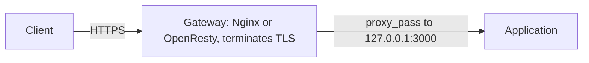

A reverse proxy gateway accepts public HTTPS traffic and forwards it to an application that listens only on a private address. This page explains the pattern, then gives the production deployment runbooks for the two gateways in the sources, Nginx and OpenResty.

## How the gateway works

A reverse proxy gateway sits in front of an application: it accepts public traffic, terminates HTTPS, and forwards requests to the application over a private address, so the application port is never exposed directly. In this wiki's sources the gateway is Nginx or OpenResty and the upstream is an application on `127.0.0.1:3000`.[^nginx-production-guide][^openresty-production-guide]

### How the pieces are named

Nginx's master process reads and validates configuration and worker processes serve requests. A `server` block is a virtual host, a `location` matches a request path, and `proxy_pass` forwards a request to the upstream application.[^nginx-production-guide]

### Nginx or OpenResty

| | Nginx | OpenResty |
| --- | --- | --- |
| What it is | The web server | An Nginx-based platform with LuaJIT and Lua modules |
| Choose it for | Static serving and reverse proxying | Gateway behaviour that needs reviewed Lua |
| On one host | Not together with OpenResty: both bind ports 80 and 443 | Replaces Nginx; not an add-on |

As described in the two deployment guides.[^nginx-production-guide][^openresty-production-guide]

### Rules that carry across

- Preserve `Host`, `X-Forwarded-For`, and `X-Forwarded-Proto`, and trust them only when traffic is constrained to an approved gateway.
- Never expose an unauthenticated development listener directly to the Internet.[^express-bff-deployment-guide]
- At the edge, Nginx and OpenResty remain useful for TLS, routing, rate limiting, and carefully bounded Lua extensions.[^modern-bff-assessment]

## Nginx production deployment

A baseline for running Nginx alone on one Ubuntu 24.04 LTS VM: static files, a [reverse proxy](#how-the-gateway-works) to an application on `127.0.0.1:3000`, and HTTPS through Certbot webroot.[^nginx-production-guide]

### Steps

1. **Prepare the host.** Confirm the domain resolves to the VM, the firewall allows TCP 80/443, time is correct, and no server owns either port (`ss -lntp`). Install `nginx`, `curl`, `ca-certificates`, and `certbot`.
2. **Configure.** Back up `/etc/nginx`, remove the default site, create a site with an ACME challenge location, a `/healthz` location returning `200`, and a `location /` that proxies to the application with `proxy_connect_timeout 5s` and `proxy_read_timeout 60s`. For a static-only site use `try_files` instead of the proxy.
3. **Enable.** Link the site, run `nginx -t`, enable the service, and reload. Always run `nginx -t` before a reload.
4. **Add HTTPS.** Prove HTTP health publicly (ACME needs public DNS and port 80), issue the certificate with `certbot certonly --webroot`, then add an HTTP-to-HTTPS redirect server that keeps the challenge location, and an HTTPS server with `ssl_protocols TLSv1.2 TLSv1.3`. Confirm `certbot renew --dry-run`.
5. **Verify each layer.** Service state, effective config (`nginx -T`), loopback health, the upstream's own health path, HTTPS via `curl --resolve`, and the journal. An open port is not an acceptance test.

Never copy `privkey.pem` into an application directory or repository.[^nginx-production-guide]

### Troubleshooting by symptom

| Symptom | First checks | Do not |
| --- | --- | --- |
| `nginx -t` fails | Reported file and line, `nginx -T` | Reload anyway |
| Port 80/443 bind failure | `ss` port check | Run Nginx and OpenResty together |
| `502` / `504` | Loopback upstream, app logs, error log, timeouts | Raise timeouts before finding the failing layer |
| `403` | `namei -l` on the web root, ownership | `chmod -R 777` |
| `404` | Effective config, `root`, location, URI | Change many locations at once |
| `413` | Whether large uploads are really required; a reviewed `client_max_body_size` | Remove limits blindly |
| ACME failure | DNS, port 80, challenge path, Certbot logs | Share keys or disable TLS checks |

As described in the guide.[^nginx-production-guide]

### Monitoring

If `nginx -V` shows `http_stub_status_module`, expose `stub_status` on a loopback-only listener; it is not an authenticated admin API. Watch availability, status codes, latency, connections, restarts, disk and inodes, certificate expiry, and upstream errors.[^nginx-production-guide]

## OpenResty production deployment

A baseline for running OpenResty alone on one Ubuntu 24.04 LTS VM. It differs from the [Nginx deployment](#nginx-production-deployment) mainly in two ways: it installs from OpenResty's package repository, and `/healthz` is served by a Lua script.[^openresty-production-guide]

### When to choose it

Only when the gateway needs reviewed Lua behaviour; ordinary Nginx covers static serving and reverse proxying. OpenResty replaces the Nginx web-server process on the host, so disable Ubuntu's `nginx` (after confirming it serves nothing required) rather than running both.

`content_by_lua_file` runs in OpenResty's event-driven request path: no blocking shell commands, blocking file I/O, unbounded loops, secrets, or ad-hoc network calls without a reviewed design.[^openresty-production-guide]

### Steps

1. **Prepare.** Check DNS, ports 80/443, time, CPU architecture (`dpkg --print-architecture`; official x86_64 packages require SSE 4.2), and port ownership.
2. **Install.** Add OpenResty's signed apt repository (arm64 uses a different repository URL), install `openresty`, and create `/etc/openresty/conf.d` and `/etc/openresty/lua`. Use the `openresty` command, not a bare `nginx` that may be another binary.
3. **Configure.** Write `health.lua` (owned by `root:root`, mode `0644`), a site file whose `/healthz` uses `content_by_lua_file`, and include `conf.d` inside `http {}` of the vendor `nginx.conf` only if no equivalent include exists. Run `openresty -t`, enable, and reload.
4. **HTTPS.** As for Nginx: prove HTTP health, issue with Certbot webroot, add the redirect and TLS servers, and dry-run renewal.
5. **Verify.** Service, Lua health, upstream health, and TLS separately; then the journal.[^openresty-production-guide]

### Troubleshooting additions

| Symptom | First checks |
| --- | --- |
| `500` on `/healthz` | Error log, Lua path and ownership, config test; never make a broken script return success |
| `502` / `504` | The loopback upstream before blaming Lua |

As described in the guide.[^openresty-production-guide]

## Related

- [Backend for frontend](express-bff.md#backend-for-frontend)
- [Safe change procedure](../operations/incident-operations.md#safe-change-procedure)

[^nginx-production-guide]: [Nginx Production Deployment and Operations for Beginners](../../sources/nginx-production-guide.md), [original](https://github.com/kelvinlee97/engineering/blob/main/Nginx/guides/nginx-production-deployment/README.md)
[^openresty-production-guide]: [OpenResty Production Deployment and Operations for Beginners](../../sources/openresty-production-guide.md), [original](https://github.com/kelvinlee97/engineering/blob/main/Nginx/guides/openresty-production-deployment/README.md)
[^express-bff-deployment-guide]: [Node.js / Express BFF Production Deployment for Beginners](../../sources/express-bff-deployment-guide.md), [original](https://github.com/kelvinlee97/engineering/blob/main/Nodejs/guides/express-bff-production-deployment/README.md)
[^modern-bff-assessment]: [Modern BFF Architecture Assessment for Beginners](../../sources/modern-bff-assessment.md), [original](https://github.com/kelvinlee97/engineering/blob/main/Nodejs/guides/modern-bff-architecture-assessment/README.md)
