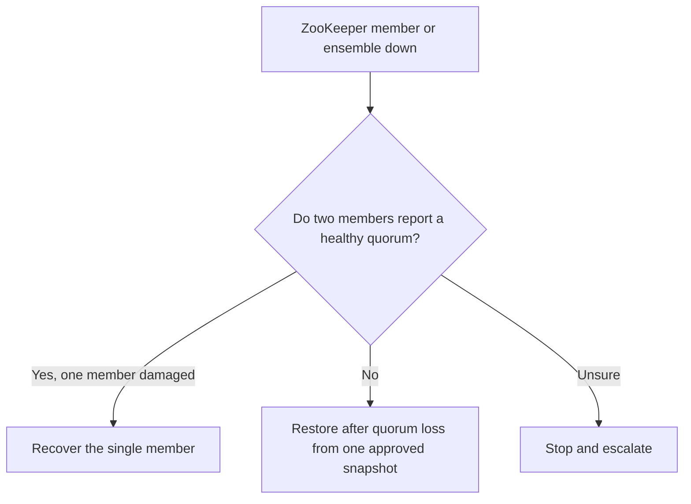

Two runbooks for a [ZooKeeper](zookeeper.md) ensemble in trouble. Pick by how much of the ensemble is down: one member that cannot start is rebuilt from its healthy peers; an ensemble that lost quorum is rebuilt from one approved snapshot.

## Recovering a single member

Use this when exactly one [ZooKeeper](zookeeper.md#what-zookeeper-is) member cannot start because a full disk left its transaction log incomplete, typically with `Last transaction was partial.`, `Unable to load database on disk`, or `java.io.EOFException`.

Freeing disk space removes the write blockage but does not repair a truncated log, and looping on restarts does not help.[^zookeeper-disk-full-runbook]

### Preconditions

Proceed only if exactly one member is damaged, the others form a healthy quorum, `dataDir` and any `dataLogDir` are known, the damaged member is stopped, and there is capacity for a backup and a fresh sync. Stop and escalate if quorum is unavailable, freshness is uncertain, or more than one member needs rebuilding.[^zookeeper-disk-full-runbook]

### Steps

1. **Confirm quorum on the healthy members.** Expect one leader and one follower, `Outstanding: 0`, and matching or converging `Zxid` and `Node count`. `imok` from `ruok` only proves the process is bound, not that it is in quorum. Do not widen the four-letter-word allowlist during the incident; on a TLS-only port use `zkServer.sh status` with TLS settings.
2. **Read the real paths** from `zoo.cfg` and `myid`; confirm no `QuorumPeerMain` process or listener remains.
3. **Move, do not delete,** the damaged `version-2` to a timestamped name, keeping `myid` unchanged; move a distinct `dataLogDir` copy separately. Do not create a new `version-2` by hand.
4. **Start the member** and look for leader discovery and a DIFF, SNAP, or TRUNC sync ending in the follower role.[^zookeeper-disk-full-runbook]

### Acceptance

One leader, two followers, `Outstanding: 0`, matching `Node count`, and matching or converging `Zxid`. Then repeat the original dependent-service request (the runbook loops it 20 times), because ZooKeeper recovering does not prove it was the only cause.

Never clear `version-2` on two or more members, copy another member's `myid`, `chmod 777`, or delete the backup right after the member rejoins.[^zookeeper-disk-full-runbook]

## Restoring after quorum loss

An incident-only procedure for a three-member [ZooKeeper](zookeeper.md#what-zookeeper-is) ensemble that has lost quorum and cannot accept updates. With no surviving authoritative copy to resync from, recovery is a rebuild from one approved snapshot. It destroys each member's current local state and may lose writes made after the snapshot.[^zookeeper-quorum-loss-runbook]

### Before starting

- Incident commander, ZooKeeper owner, application owners, and security owner approve it.
- Client traffic is blocked and applications are stopped or in safe mode.
- No two members report a healthy quorum; if two do, use [single-member recovery](#recovering-a-single-member) instead.
- One approved snapshot with a verified SHA-512 checksum, an administrator certificate already proven to hold `ALL` on `/`, `serializeLastProcessedZxid` enabled, and a rehearsal in an isolated environment.[^zookeeper-quorum-loss-runbook]

### Steps

1. **Confirm quorum loss and preserve evidence** on all three members. `ruok` is not quorum evidence.
2. **Enable a temporary AdminServer** on one member through a systemd drop-in: bound to `127.0.0.1:8443`, HTTPS forced, client certificate required. Reach it only through an SSH tunnel, and confirm a request without the client certificate fails.
3. **Restore member by member.** Stop the member, move both `version-2` directories aside with a timestamp, create empty ones plus the one-time `initialize` marker, start it, `POST` the same verified snapshot to `/commands/restore`, then persist it with `/commands/snapshot?streaming=false` and record `last_zxid`. Never mix snapshots or run members in parallel.
4. **Re-form quorum** without restarting: wait for election and check for exactly one leader and two followers. If it does not form, stop and escalate rather than retrying as an experiment.
5. **Close the recovery interface.** Remove the drop-in, restart one member at a time, and confirm nothing listens on `8443`. Run each application's ACL checks, reopen traffic gradually, and keep the preserved directories until the incident closes.[^zookeeper-quorum-loss-runbook]

## Related

- [Incident closure criteria](../operations/incident-operations.md#incident-closure-criteria)
- [ZooKeeper production deployment](zookeeper.md#production-deployment)

[^zookeeper-disk-full-runbook]: [ZooKeeper Disk-Full Recovery Runbook](../../sources/zookeeper-disk-full-runbook.md), [original](https://github.com/kelvinlee97/engineering/blob/main/ZooKeeper/runbooks/disk-full-transaction-log-recovery/README.md)
[^zookeeper-quorum-loss-runbook]: [ZooKeeper Quorum-Loss Snapshot Restore Runbook](../../sources/zookeeper-quorum-loss-runbook.md), [original](https://github.com/kelvinlee97/engineering/blob/main/ZooKeeper/runbooks/quorum-loss-snapshot-restore/README.md)
