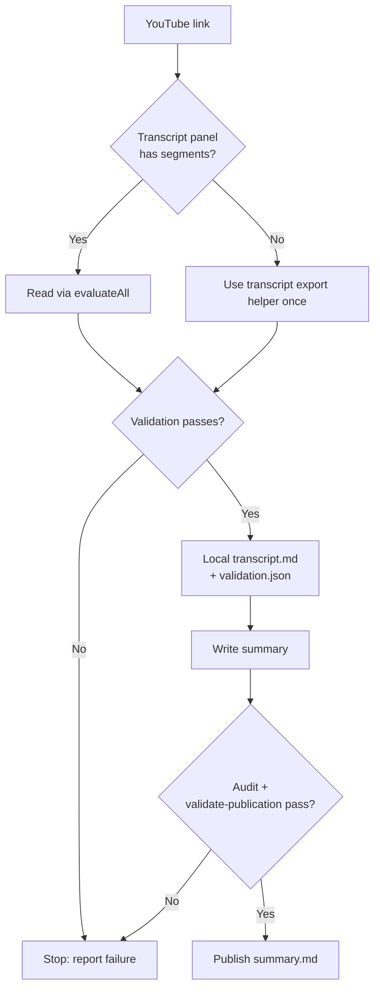

# YouTube Transcript Skill

> One YouTube link produces one validated local transcript before any summary is written; capture, validation, and summarization are separate gates, and a failure at any gate stops the workflow instead of retrying or falling back to a third-party source.

This local-first transcript skill first reads the mounted Transcript segments through one Chrome `evaluateAll` call. If YouTube leaves that panel empty, it uses Chrome's YouTube transcript export once instead. The paths are mutually exclusive; failure is reported without retrying or switching to a third-party source. It does not download media, call `yt-dlp` or a transcript API, use Whisper, or infer missing content from a title or description.

The user gives the agent a YouTube link. It exports one complete transcript, validates its coverage, saves a local `transcript.md`, and only then writes a reader-facing summary. A failed first attempt stops the workflow.



## Output contract

```text
# Ignored local evidence
.local/youtube/<title-slug>--<video-id>/
├── transcript.md
└── validation.json

# Published reading file
YouTube/<topic>/<title-slug>--<video-id>/
└── summary.md
```

`transcript.md` and `validation.json` are intentionally ignored by Git. Full transcripts can be copyrighted; only the reader-facing summaries are published.

## Capture contract

A Chrome capture retains one complete ordered read. The Skill opens YouTube's Transcript panel, waits up to 10 seconds for its segments, and extracts their timestamps and text together. If no eligible segments mount, it invokes Chrome's transcript helper once and parses the saved export locally, leaving headroom within the browser command deadline. The validator then derives count, endpoints, and canonical SHA-256. It requires non-empty segments with non-decreasing finite timestamps, an exact normalized URL/video-ID match, a start close to the beginning, and an end close to the reported duration. It records gaps over 60 seconds as warnings that must be resolved before publication. Read or validation failure stops the workflow.

It produces deterministic chunks of roughly 1,000 text units—English word runs and individual CJK characters—and a local `validation.json` coverage ledger. A complete capture proves structural coverage of the supplied read; it does not prove browser-export authenticity, semantic completeness of a summary, or that YouTube's captions are word-perfect.

## Summary contract

Before publishing, the Skill must process every chunk, record every substantive item as `included`, `compressed`, or a pure `cta` with source segment IDs and quotes, then perform a fresh audit. Publication is blocked unless:

```text
processed segments = captured segments
missing substantive items = 0
unsupported claims = 0
```

No summary may add recommendations, plans, corrections, or outside facts. Pure subscribe, like, comment, and share calls to action may be omitted.

## Local validator

The validator uses only the Python standard library. It accepts a temporary browser export with one complete read:

```json
{
  "metadata": {
    "source_url": "https://www.youtube.com/watch?v=VIDEO_ID",
    "video_id": "VIDEO_ID",
    "title": "Video title",
    "channel": "Channel name",
    "duration_seconds": 1234,
    "language": "en",
    "subtitle_type": "auto-generated"
  },
  "segments": [{"start_seconds": 0, "text": "First segment"}]
}
```

```bash
cd youtube-transcript
uv sync --group dev
uv run yt-transcript capture browser-export.json \
  --output ../../.local/youtube/<title-slug>--<video-id>
```

This command is an internal Skill step, not a user workflow.

After the Skill marks every chunk processed and completes its manual audit, it also runs:

```bash
uv run yt-transcript validate-publication \
  ../../.local/youtube/<title-slug>--<video-id>/validation.json \
  ../../YouTube/<topic>/<title-slug>--<video-id>/summary.md
```

This gate checks ledger structure and contiguous chunks, source video ID, timestamp range, source segment binding, required timestamps, and unresolved capture warnings; it does not determine whether a summary is semantically complete or source-faithful.

## Development

```bash
node --test ../../.agents/skills/youtube-transcript/tests/read-transcript.test.mjs
uv run pytest
uv run ruff check .
uv run mypy src
```
